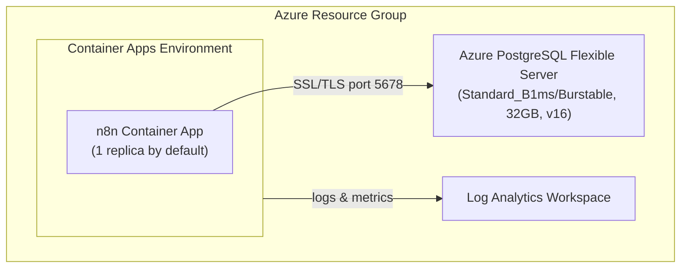

# n8n Azure Configuration Skill

Application-specific configuration for deploying n8n to Azure Container Apps with PostgreSQL. Infrastructure should be generated fresh by the `azure-prepare` → `azure-validate` → `azure-deploy` pipeline.

## Prerequisites and Portability

Require Azure CLI, Azure Developer CLI 1.28.0 or later, and Node.js LTS or later. Generated lifecycle hooks must be CommonJS JavaScript (`.js`) or TypeScript (`.ts`) files referenced directly from `azure.yaml`; azd 1.28.0 rejects `.mjs` hook paths. Do not generate Bash-only `.sh` or PowerShell-only `.ps1` hooks. See `../../../docs/tool-installation.md` for Windows, Mac, and Linux installation options.

## Critical: Subscription Context

**ALWAYS set AZURE_SUBSCRIPTION_ID explicitly before running `azd up`.** Read it with `az account show --query id -o tsv`, then pass the returned value to `azd env set AZURE_SUBSCRIPTION_ID <subscription-id>`. Do not emit Bash command substitution when the operating system is unknown.

## Critical: PostgreSQL AVM Defaults

**📖 See [../config/postgresql-avm-defaults.md](../config/postgresql-avm-defaults.md) for all PostgreSQL AVM gotchas** (publicNetworkAccess, passwordAuth, HA, password pinning). Without these settings, n8n will fail with "authentication failed" or "connection timeout".

**n8n-specific:** Pin `POSTGRES_PASSWORD` and `N8N_ENCRYPTION_KEY` in the azd environment so redeployments keep the same values. Generate both with Node's `crypto.randomBytes()` or another cryptographically secure platform API. Do not require `openssl`, and do not create `N8N_AUTH_PASSWORD`; current n8n releases use built-in owner-account management rather than the removed `N8N_BASIC_AUTH_*` variables.

## Critical: PostgreSQL SKU Format

```bicep
sku: { name: 'Standard_B1ms', tier: 'Burstable' }  // Both fields required
```

## Official Documentation

- n8n Docker Installation: https://docs.n8n.io/hosting/installation/docker/
- n8n Environment Variables: https://docs.n8n.io/hosting/configuration/environment-variables/

## Quick Start (Verified)

```text
# 1. Register providers (one-time per subscription)
az provider register --namespace Microsoft.App
az provider register --namespace Microsoft.DBforPostgreSQL
az provider register --namespace Microsoft.OperationalInsights

# 2. Create environment
azd env new my-n8n-env

# 3. Set required variables (replace placeholders with collected/generated values)
azd env set AZURE_SUBSCRIPTION_ID "<subscription-id>"
azd env set AZURE_LOCATION "westus"
azd env set POSTGRES_PASSWORD "<generated-secret>"
azd env set N8N_ENCRYPTION_KEY "<generated-secret>"

# 4. Deploy (~7-10 minutes)
azd up

# 5. Access n8n
azd env get-value N8N_URL
# First launch: complete the Set up owner account flow
```

**Deployment time breakdown:**
- Resource Group: ~4s
- Log Analytics: ~25s
- Container Apps Environment: ~38s
- PostgreSQL Flexible Server: ~4-5 min
- n8n Container App: ~20s
- **Total: ~7 minutes**

## Key Configuration Files

| File | Purpose |
|------|---------|
| `config/environment-variables.md` | All n8n environment variables for Azure |
| `config/health-probes.md` | Health probe timing for n8n startup |
| `troubleshooting.md` | Common issues and solutions |

## Architecture



## n8n-Specific Requirements

### Container Configuration

| Setting | Value | Reason |
|---------|-------|--------|
| Image | `docker.io/n8nio/n8n:2.30.6` | Pin a tested official image; never use `latest` |
| Port | 5678 | n8n default port |
| CPU | 1.0 cores | Minimum for responsive UI |
| Memory | 2Gi | n8n recommended minimum |
| Min Replicas | 1 by default | Required for scheduled, polling, and background workflows while HTTP traffic is idle |
| Max Replicas | 1 | This lab doesn't coordinate multiple n8n main processes |
| Active Revisions Mode | Single | Don't route traffic across multiple independently running main revisions |

### Scaling Constraints

Generate `minReplicas: 1`, `maxReplicas: 1`, and `activeRevisionsMode: 'Single'`. PostgreSQL persistence alone doesn't coordinate multiple n8n main processes; scaling them out can duplicate triggers. Don't add Redis, queue workers, or enterprise multi-main configuration to this lab. See [n8n's multi-main requirements](https://docs.n8n.io/deploy/host-n8n/configure-n8n/scaling/enable-queue-mode.md#multi-main-setup) for why that is a separate architecture.

Don't automatically reduce `minReplicas` after verification. Scheduled triggers, polling, and persistent connections can't wake an HTTP-scaled Container App from zero. Allow `minReplicas: 0` only when the learner explicitly chooses an idle demo, no executions are in progress, and they accept that background automation won't run while scaled to zero. Retain `maxReplicas: 1`.

### Health Probes (CRITICAL)

n8n requires **60+ seconds** to start. See `config/health-probes.md`.

**Without proper health probes, containers will crash before n8n initializes!**

Use the dedicated health endpoint `/healthz` for startup, readiness, and liveness probes. Do not probe `/`; the UI root can redirect or stall while the app is still initializing. When using the AVM Container App module, use `startup.failureThreshold: 10` with `startup.periodSeconds: 30` for a five-minute startup window, because AVM caps `failureThreshold` at 10.

### Database Requirements

- PostgreSQL 15 or 16 (Flexible Server)
- SSL enabled (required by Azure)
- FQDN connection (not internal hostname)

### Python Task Runner Limitation

The pinned image doesn't include Python 3 and can log `Failed to start Python task runner in internal mode`. This lab doesn't support Python Code-node execution. Don't install Python on the host or add workers merely to suppress this message. Confirm the JavaScript task runner registers and the health/UI criteria pass; investigate unrelated errors rather than treating every log warning as harmless. See [troubleshooting.md](troubleshooting.md#issue-14-python-task-runner-warning).

## Cost Estimate (Dev Environment)

The default always-on Container App costs approximately **$60-80/month**, plus database and logs. The following lower estimate applies only to the optional scale-to-zero demo described above:

| Resource | Monthly Cost |
|----------|--------------|
| Container Apps (scale-to-zero) | ~$5-15 |
| PostgreSQL Flexible Server | ~$15 |
| Log Analytics | ~$2-5 |
| **Total** | **~$25-35/month** |

## Verification

After `azd up`, run the verification commands in [troubleshooting.md](troubleshooting.md). Key checks: HTTP 200 from `$N8N_URL/healthz`, HTTP 200 from the n8n UI URL, the owner-setup or login page renders, and `N8N_WEBHOOK_URL` matches the deployed HTTPS URL. Inspect container logs for startup and database failures; report the documented Python-runner limitation separately rather than claiming error-free logs. In CI, poll `/healthz` for up to 5 minutes before checking the UI.

Also inspect `properties.template.scale` and `properties.configuration.activeRevisionsMode` on the deployed Container App through Azure CLI. Require maxReplicas=1 and Single revision mode; require minReplicas=1 unless the learner explicitly selected the idle-demo exception. The checked-in HTTP verifier doesn't assert these settings.

## Cross-Platform Post-Provision Hook

Generate `infra-n8n/hooks/postprovision.js` and reference it directly from `azure.yaml`:

```yaml
hooks:
  postprovision:
    run: ./infra-n8n/hooks/postprovision.js
```

The hook must use argument arrays to call `azd` and `az`; it must not assemble shell command strings. On Mac and Linux, call each executable directly. On Windows, `.cmd` shims cannot be launched through `execFileSync()` or `spawnSync()` alone, so use the static PowerShell runner and JSON environment payload defined by the `container-apps-deployment` skill. Reject double quotes for every Windows target and additional shell metacharacters or CR/LF for `.cmd`/`.bat`; native `.exe` targets preserve the remaining metacharacters. Read the Container App FQDN, then make one `az containerapp update` call with `--set-env-vars N8N_WEBHOOK_URL=https://<fqdn>` and `--remove-env-vars WEBHOOK_URL`. Never use `--replace-env-vars` or `--remove-all-env-vars`; those options can discard unrelated variables and secret references. A fresh deployment may report that `WEBHOOK_URL` doesn't exist; this is benign and must not fail an otherwise successful update. See [the pinned-release configuration contract](config/environment-variables.md#webhook-configuration). Fail with a nonzero exit code if the CLI update fails. The update creates a replacement revision, so poll both `/healthz` and `/` for up to five minutes and require six consecutive HTTP 200 results over 30 seconds before returning. One successful probe is insufficient while Azure is deprovisioning the old revision.

When a module parameter receives `uniqueString()` output, declare its exact contract with `@minLength(13)` and `@maxLength(13)`. This prevents false `BCP334` name-length warnings in downstream resources.

## Tear Down

```bash
azd down --force --purge
```

**Note:** Full teardown can take several minutes. Azure can retain PostgreSQL recovery backups for five days after server deletion. `--purge` and resource-group absence don't prove immediate erasure of provider-held backups. Follow the journey's [Cleanup](../../../journeys/n8n/README.md#cleanup) instructions and report resource deletion separately from backup retention.

## n8n-Specific Quirks

1. **Slow startup** — needs 60s+ `initialDelaySeconds` on liveness probe and a five-minute startup window
2. **SSL** — requires `SSL_REJECT_UNAUTHORIZED=false` for Azure PostgreSQL
3. **N8N_WEBHOOK_URL** — set post-deployment via hook (circular dependency with FQDN)
4. **Port 5678** — non-standard port for health checks and ingress
5. **PostgreSQL AVM defaults** — see [../config/postgresql-avm-defaults.md](../config/postgresql-avm-defaults.md)
6. **CI health checks** — set `minReplicas: 1`, probe `/healthz`, and wait for health before UI checks
7. **AVM probe failureThreshold cap** — capped at 10; use `periodSeconds: 30` with `failureThreshold: 10` for 5 min window

## Azure MCP Tools

Use these Azure MCP Server tools for n8n deployments:

| Tool | When to Use |
|------|-------------|
| `azure_bicep_schema` | Get latest schemas for `Microsoft.App/containerApps` and `Microsoft.DBforPostgreSQL/flexibleServers` |
| `azure_deploy_architecture` | Generate Mermaid architecture diagrams for the n8n deployment |
| `azure_deploy_plan` | Validate the deployment plan before `azd up` — use `target=ContainerApp` |
| `azure_deploy_app_logs` | Fetch container logs from Log Analytics when troubleshooting startup or connectivity issues |

## Reproducibility Notes

This deployment has been tested multiple times and is verified working:
- ✅ Clean environment deployment
- ✅ Teardown and redeploy
- ✅ Parameter interpolation via `${VAR}` syntax in main.parameters.json
- ✅ Post-provision hook configures the public webhook base URL
