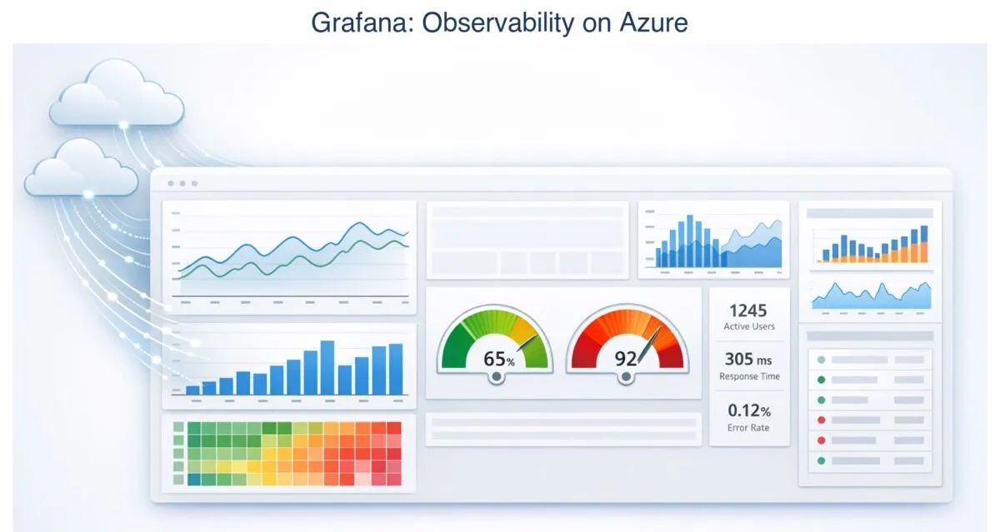
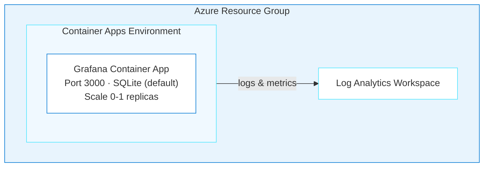
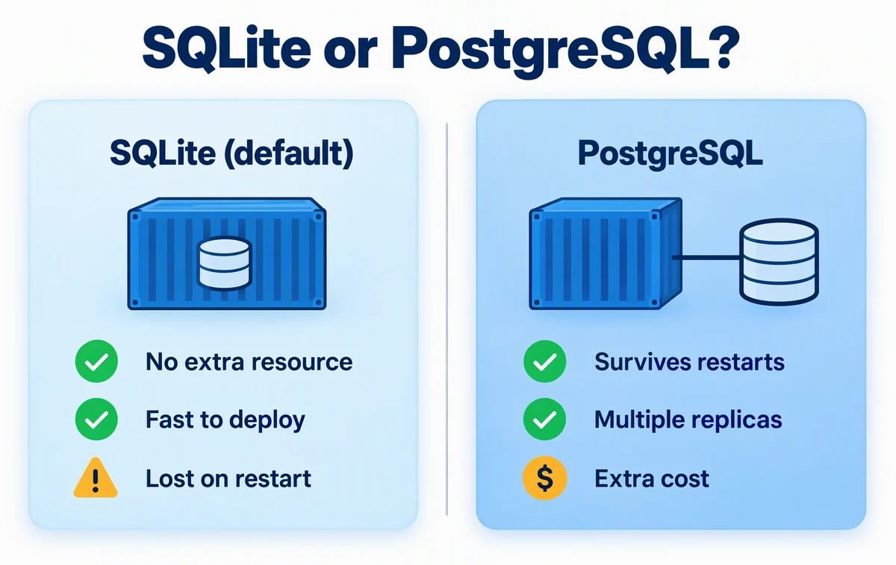

# Grafana on Azure Container Apps

> ✨ **Deploy Grafana on Container Apps with an embedded database and simple health probes.**

<p align="center">
  
</p>

You'll deploy [Grafana OSS](https://grafana.com/oss/grafana/), an open-source observability platform, to Azure Container Apps. Grafana uses an embedded SQLite database by default, so there is no external database to provision. That keeps the deployment small and fast, and you'll decide for yourself when PostgreSQL is worth it.

## Learning Objectives

- Plan and cost a deployment with an agent, preview it, then run `azd up` yourself
- Decide between SQLite and PostgreSQL for Grafana, and see the tradeoff for yourself
- Use `/api/health` for health probes, and recognize a scale-to-zero cold start
- Operate the deployed app through its API with a script the agent writes

> 💰 **Estimated Cost**: ~$10–20/month while the resources exist (see [Cost Breakdown](#cost-breakdown)). Complete the [Cleanup](#cleanup) procedure when you finish the journey.

## Prerequisites

This journey supports Windows PowerShell, Mac, and Linux.

| Host tool | Requirement | Purpose | Validation |
| --- | --- | --- | --- |
| [Azure CLI](https://learn.microsoft.com/cli/azure/install-azure-cli) | Required | Authenticate and manage Azure resources | `az version` |
| [Azure Developer CLI (`azd`)](https://learn.microsoft.com/azure/developer/azure-developer-cli/install-azd) 1.28.0 or later | Required | Provision and remove the deployment | `azd version` |
| [Node.js](https://nodejs.org/en/download) LTS or later | Required | Run the portable verifier | `node --version` |
| [GitHub Copilot CLI](https://docs.github.com/en/copilot/how-tos/copilot-cli/cli-getting-started) | Required for the documented CLI path | Run the deployment agent | `copilot --version` |

The signed-in Azure account must have permission to create resource groups, Container Apps, managed identities, and Log Analytics resources.

**Before you start:**

1. Run each command in the Validation column, and install anything that fails. The [cross-platform installation guide](../../docs/tool-installation.md) has Windows, Mac, and Linux options.
2. Confirm that `az account show --output table` shows the subscription you intend to use.
3. Run `azd config set auth.useAzCliAuth true`, so `azd` reuses your Azure CLI sign-in.
4. Inside `copilot`, install the Azure Skills plugin once: `/plugin marketplace add microsoft/azure-skills`, then `/plugin install azure@azure-skills`.

> [!NOTE]
> GitHub Copilot CLI is the documented and validated command-line path. You may adapt the deployment prompt for another agentic coding tool. For another tool, run: **"Copy or adapt this repository's `.github/skills` into your supported skills or instructions location, preserving their behavior and reporting anything unsupported."**

### Acceptance criteria

The deployment is complete when:

- [ ] `<grafana-url>/api/health` returns HTTP 200 with `"database":"ok"`.
- [ ] The browser login succeeds with the deployed admin credentials.
- [ ] The SQLite deployment has `maxReplicas: 1`.

The journey is complete after the [Cleanup](#cleanup) procedure removes the Azure resources.

---

## Architecture



**Azure resources created:**

- **Azure Container Apps**: Serverless hosting with scale-to-zero
- **Azure Log Analytics**: Monitoring and diagnostics
- **SQLite** (default): Embedded database, no external dependency
- Optional: **Azure Database for PostgreSQL Flexible Server** for production persistence

**Infrastructure directory:** `infra-grafana/` (generated at the repo root when you run the deployment; it won't exist until then)

---

## Deploy with the Agent

In GitHub Copilot, use the repository's `oss-to-azure-deployer` agent to generate and deploy the infrastructure from your prompts.

<details>
<summary><strong>When something fails</strong></summary>

AI-generated infrastructure isn't deterministic, so expect an occasional failure. Stay in the same Copilot session, remove passwords, tokens, keys, and connection strings from the output, and use this prompt:

```text
The following command failed during <journey phase> on <OS and shell>:

<exact command>

Relevant error output:

<redacted error output>

Inspect the relevant application and Azure logs, explain the root cause,
make the smallest safe fix, rerun the failed step, and run the journey
verifier. Don't change the checked-in verifier. Record the issue and
resolution in issues.md. Do not print secrets.
```

After the fix, run `git diff -- :/.github/scripts`. It must print nothing: a fix that edits the checked-in verifier hides the problem instead of solving it. If the fix doesn't hold, ask again, and don't accept "contact support" until the agent has narrowed the failure to one resource or setting.

</details>

### Step 1: Setup

From the repository root (run `cd agentic-journeys` if you're one level up), start [GitHub Copilot CLI](https://docs.github.com/en/copilot/how-tos/copilot-cli/cli-getting-started) and select the deployment agent:

```text
copilot
```

```
> /agent
```

Choose **`oss-to-azure-deployer`**, a custom agent defined in this repository that knows how to deploy open-source apps to Azure. Every prompt below goes to this agent, in this one session.

### Step 2: Plan the deployment

Before anything is created, ask for the plan and what it costs. This is read-only:

```
> Plan a Grafana deployment to Azure Container Apps with Bicep and azd:
  SQLite in the container's local storage (no Azure Files mount),
  minReplicas: 0 and maxReplicas: 1, /api/health for probes, and the westus
  region. List each Azure resource, its SKU, and the estimated monthly cost
  if left running. Don't create files or Azure resources yet.
```

Check the plan against the [architecture](#architecture): one Container App, a Container Apps environment, and Log Analytics, with no database server. Then ask about the one real decision in this deployment:

```
> Should I use PostgreSQL instead of SQLite for Grafana?
```

<p align="center">
  
</p>

A good answer matches this picture: SQLite suits development and testing, but dashboards disappear when the container restarts. For production, mount Azure Files at `/var/lib/grafana` or switch to PostgreSQL. Keep SQLite for this journey; you'll see the tradeoff for yourself in the [Assignment](#assignment).

### Step 3: Generate and preview

```
> Generate the infrastructure for that plan: Bicep in infra-grafana/ and
  azure.yaml. Generate a secure admin password and store it only in the azd
  environment. Prepare the azd environment for westus and my current
  subscription, then run azd provision --preview and summarize what it
  will create. Don't run azd up. If a step fails, inspect the relevant
  logs, make the smallest safe correction, rerun the failed step, and
  record the problem and resolution in issues.md. Do not print secrets.
```

<p align="center">
  
</p>

The agent loads the `grafana-azure` and `container-apps-deployment` skills, uses the Azure Skills plugin for current Bicep schemas, and generates `infra-grafana/`. The preview lists what `azd up` would create without creating it. Compare it with the plan from Step 2: the same resources, and nothing you didn't expect. If the preview shows anything the plan didn't, ask the agent why before you deploy.

### Step 4: Deploy

Deploying is the consequential step, so run it yourself from the repository root and watch the output:

```text
azd up
```

The agent already prepared the environment, so `azd` shouldn't ask any questions. If it fails, use the "When something fails" prompt in the same Copilot session.

> ⏳ **While you wait:** This is the fastest deployment in the project because there is no database server to provision. Compare the [architecture diagram](#architecture) with the [n8n architecture](../n8n/README.md#architecture). You can also watch the resources appear by running `az resource list --resource-group rg-<env-name> --output table` in a separate terminal.

### Step 5: Verify

Run the checked-in verifier from the repository root:

```text
node .github/scripts/verify-grafana.mjs
```

It must print `PASS: <grafana-url>/api/health returned HTTP 200 and database=ok` and the URL. Then have the agent check the rest of the acceptance criteria:

```text
> Verify the Grafana deployment. Report each acceptance criterion as pass or fail.
```

Open the URL and sign in as `admin`. Read the password with `azd env get-value GRAFANA_ADMIN_PASSWORD` in a private terminal, and don't paste it into the agent session. A 502 on the first request is usually a cold start from zero replicas; wait 30 to 60 seconds and retry.

### Step 6: Build a dashboard with Copilot

A health check proves Grafana is up. Now have Copilot use it:

```
> Create scripts/create-grafana-dashboard.mjs. It reads GRAFANA_URL and
  GRAFANA_ADMIN_PASSWORD through azd env get-value with argument arrays and
  never prints the password. Through the Grafana HTTP API, it creates the
  built-in TestData data source if it doesn't exist, then creates a
  dashboard named "Hello from Azure" with one time series panel that uses
  it, and prints the dashboard URL. Then run the script.
```

Open the printed URL, sign in as `admin`, and look at your panel. Keep the dashboard: the [Assignment](#assignment) restarts the container to see what SQLite does with it.

**💡 What you're learning:** The agent that deployed the app can also operate it through the app's own API, with a script you can read and rerun.

---

<details>
<summary>Configuration Reference (handled by the agent automatically)</summary>

## Configuration Reference

### Environment Variables

| Variable | Value | Description |
|----------|-------|-------------|
| `GF_SECURITY_ADMIN_USER` | `admin` | Admin username |
| `GF_SECURITY_ADMIN_PASSWORD` | (secret) | Admin password |
| `GF_SERVER_HTTP_PORT` | `3000` | HTTP port |
| `GF_SERVER_ROOT_URL` | Auto-configured | Public URL |
| `GF_AUTH_ANONYMOUS_ENABLED` | `false` | Disable anonymous access |
| `GF_DATABASE_TYPE` | `sqlite3` | Default database |
| `GF_LOG_MODE` | `console` | Log output mode |
| `GF_LOG_LEVEL` | `info` | Log verbosity |

### Container Resources

| Setting | Value |
|---------|-------|
| Image | `docker.io/grafana/grafana:latest` |
| CPU | 0.5 cores |
| Memory | 1 GiB |
| Min Replicas | 0 (scale-to-zero) |
| Max Replicas | 1 (required for SQLite) |
| Scale Rule | HTTP requests (10 concurrent per replica) |

Keep `maxReplicas: 1` while using SQLite. Each replica would otherwise have its own database, so dashboards, users, and sessions could differ between requests even without a restart. Scale-to-zero remains available with `minReplicas: 0`.

### Health Probes

Grafana starts fast (~15-30 seconds) and provides a dedicated health endpoint at `/api/health`.

| Probe | Initial Delay | Period | Failure Threshold |
|-------|---------------|--------|-------------------|
| Startup | n/a | 10s | 30 (5 min max) |
| Liveness | 15s | 30s | 3 |
| Readiness | n/a | 10s | 3 |

Health endpoint response:

```json
{"commit": "abc123", "database": "ok", "version": "10.x.x"}
```

### Storage: SQLite vs PostgreSQL

**SQLite (default):**
- Zero setup, embedded in the container
- ⚠️ Dashboards lost on container restart (ephemeral storage)
- Good for dev/testing

**PostgreSQL (production):**
Add these environment variables for persistent storage:

```yaml
GF_DATABASE_TYPE: postgres
GF_DATABASE_HOST: your-server.postgres.database.azure.com
GF_DATABASE_NAME: grafana
GF_DATABASE_USER: grafana
GF_DATABASE_PASSWORD: <secret>
GF_DATABASE_SSL_MODE: require
```

**Alternative:** Mount Azure Files to `/var/lib/grafana` for persistent SQLite, keeping `maxReplicas: 1`. Persistence doesn't make SQLite suitable for multiple Grafana replicas; those require a shared PostgreSQL or MySQL database.

</details>

---

## Cost Breakdown

| Resource | SKU | Monthly Cost |
|----------|-----|--------------|
| Container Apps (scale-to-zero) | Consumption (0.5 vCPU, 1GB) | ~$5-10 |
| Log Analytics | Pay-per-GB | ~$2-5 |
| **Total (SQLite)** | | **~$10-20/month** |
| + PostgreSQL (optional) | Standard_B1ms · Burstable | +~$15/month |

---

<details>
<summary>Troubleshooting</summary>

## Troubleshooting

### Container Won't Start

Ask the agent to diagnose:

```
> My Grafana container won't start. Check the logs and tell me what's wrong.
```

The agent uses `azure_deploy_app_logs` to pull logs and identify the issue, typically health probes that are too aggressive. The Bicep templates in `infra-grafana/` include proper timing.

### 502 Bad Gateway

**Cause:** This typically happens on the first request after the container scales from zero. Cold start takes 30-60s. This is a one-time delay, not a persistent issue.

**Fix:** Wait 30-60 seconds and retry. For production, set `minReplicas: 1` to keep one instance warm.

### Login Fails

**Cause:** Password not set correctly, or special characters causing shell escaping issues.

**Fix:**

Ask the agent:

```
> My Grafana login isn't working. Check if the admin password environment variable is set correctly.
```

If the agent finds shell escaping issues, use alphanumeric passwords and redeploy.

### Dashboards Lost After Restart

**Cause:** SQLite stores data in ephemeral container storage.

**Fix:**
1. Add Azure Files volume mount for `/var/lib/grafana`
2. Switch to PostgreSQL backend (recommended for production)
3. Export dashboards as JSON and use Grafana provisioning

---

> **Post-Deployment Issues:** The following issues relate to *using* Grafana after deployment, not the deployment itself.

### Can't Connect to Data Sources

**Fix:**
1. Ensure data sources are in the same VNet or publicly accessible
2. For Azure services, use private endpoints
3. Check NSG rules if using VNet integration

### Out of Memory (OOMKilled)

**Fix:** Increase memory in Bicep:

```bicep
resources: {
  cpu: json('0.5')
  memory: '2Gi'  // Increase from 1Gi
}
```

</details>

---

## Key Learnings

- **Plan, preview, then deploy.** A read-only plan and `azd provision --preview` show what you'll pay for before anything exists.
- **Embedded storage is still a persistence decision.** SQLite data is ephemeral in this container deployment, so plan for that before production.
- **Scale-to-zero cold starts are normal.** 30-60s on first request isn't an error.
- **Same agent, different skills.** The agent loaded `grafana-azure` instead of `n8n-azure` and adapted automatically.
- **Simpler apps mean simpler infrastructure.** No database dependency means fewer moving parts to break.

---

## Assignment

1. Restart the container app that holds your "Hello from Azure" dashboard:

   Ask GitHub Copilot to generate `scripts/restart-grafana.mjs`. It must read the resource group through `azd`, locate the tagged Grafana Container App and its active revision through Azure CLI argument arrays, then restart only that revision. Run `node scripts/restart-grafana.mjs`.

   (If an `azd env get-value` lookup fails, just ask the agent: *"Restart my Grafana container app."*)

   After the restart, check whether the dashboard still exists. With the default ephemeral SQLite storage, it should be gone. Ask the agent: *"Why did my Grafana dashboard disappear after a restart?"*
2. Try the fix: ask the agent *"How do I make Grafana dashboards persist across restarts?"* and implement what it suggests.
3. When you're done, continue to Cleanup below.

---

## Cleanup

> [!CAUTION]
> This command permanently deletes the Azure deployment. Export any dashboard definitions that you want to keep before you continue.

Read and save the generated resource group name:

```text
azd env get-value RESOURCE_GROUP_NAME
```

Run the cleanup from the repository root on the host machine:

```text
azd down --force --purge
```

Deleting the Container Apps environment can take 3–5 minutes. The command must exit successfully. Verify that the generated resource group is gone:

```text
az group exists --name <resource-group-name>
```

The command must return `false`. If cleanup fails or the resource group still exists, use the **When something fails** procedure in [Deploy with the Agent](#deploy-with-the-agent) and do not assume that Azure stopped billing the resources.

---

## What's Next

**Take it home:** the same agent deploys other open-source apps. Ask `@oss-to-azure-deployer` *"How would I deploy Uptime Kuma to Azure?"* and compare its plan with this one.

Explore the other journeys:

- [n8n](../n8n/README.md) — Container Apps + PostgreSQL, health probes, post-provision hooks
- [Superset](../superset/README.md) — AKS, init containers (higher cost)
- [AIMarket](../aimarket/README.md) — full-stack build from a PLAN.md spec with Foundry

> 📚 **All journeys:** [Back to root README](../../README.md#agentic-journeys)

---

## Resources

- [Grafana Documentation](https://grafana.com/docs/grafana/latest/)
- [Azure Container Apps](https://learn.microsoft.com/azure/container-apps/)
- [Azure Developer CLI](https://learn.microsoft.com/azure/developer/azure-developer-cli/)
