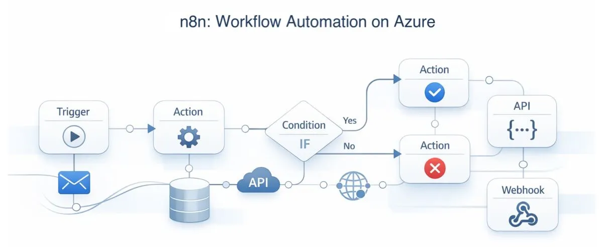
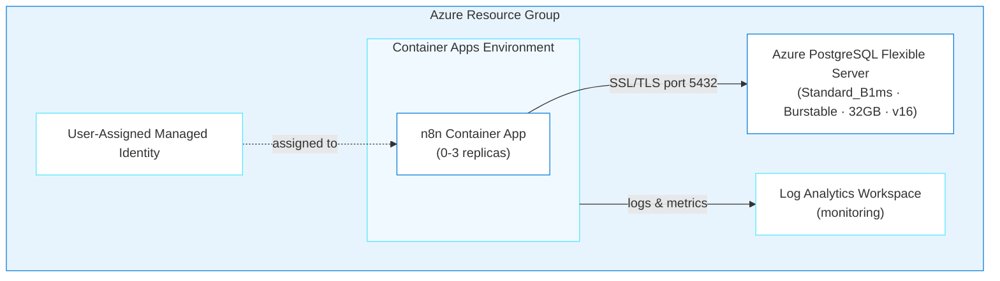
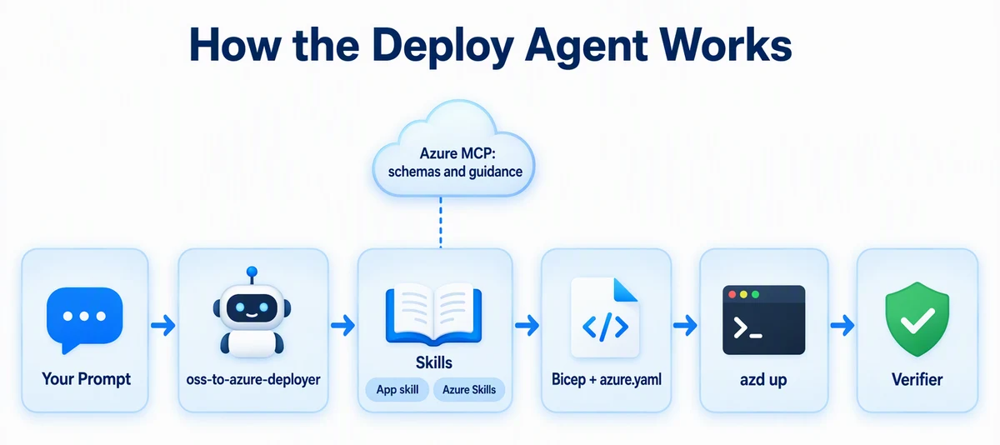
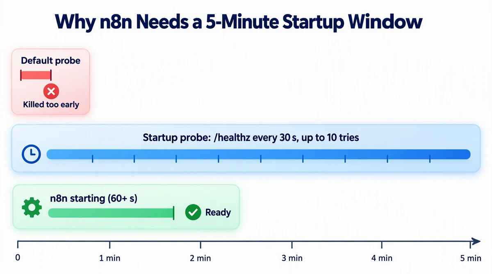
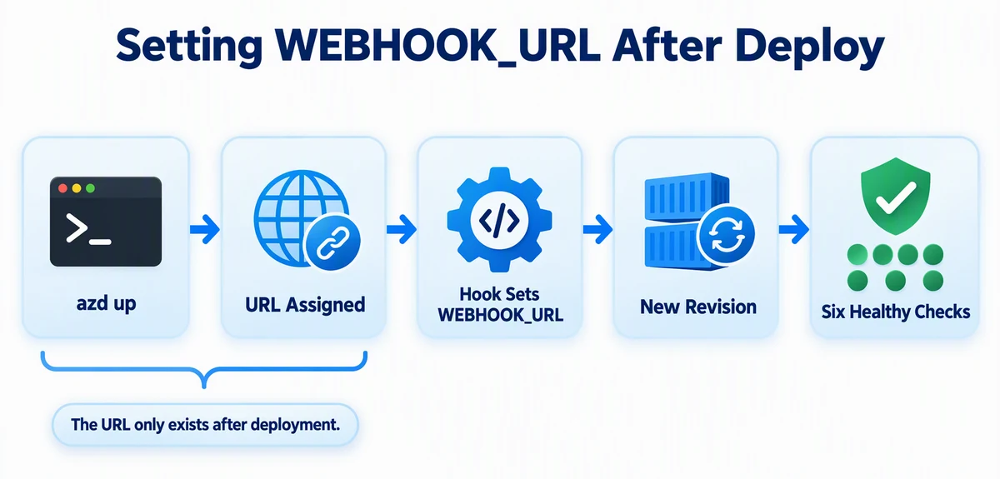

# n8n on Azure Container Apps

> ✨ **Deploy a self-hosted workflow automation platform to Azure by having a conversation with an AI agent.**

<p align="center">
  
</p>

In this journey, you'll deploy [n8n](https://n8n.io), an open-source, self-hosted workflow automation tool, to Azure Container Apps with PostgreSQL. An AI agent plans and generates the infrastructure, you deploy it, and then the agent builds a workflow that runs on it.

## Learning Objectives

- Plan and cost a deployment with the `oss-to-azure-deployer` agent, preview it, then run `azd up` yourself
- See how the agent combines app-specific and Azure skills to generate Bicep
- Configure health probes for a slow-starting container, and set a URL that only exists after deployment
- Have the agent build an n8n workflow while the deployment runs, then run it through the n8n API

> 💰 **Estimated Cost**: ~$25–35/month while the resources exist (see [Cost Breakdown](#cost-breakdown)). Complete the [Cleanup](#cleanup) procedure when you finish the journey.

## Prerequisites

This journey supports Windows PowerShell, Mac, and Linux.

| Host tool | Requirement | Purpose | Validation |
| --- | --- | --- | --- |
| [Azure CLI](https://learn.microsoft.com/cli/azure/install-azure-cli) | Required | Authenticate and manage Azure resources | `az version` |
| [Azure Developer CLI (`azd`)](https://learn.microsoft.com/azure/developer/azure-developer-cli/install-azd) 1.28.0 or later | Required | Provision and remove the deployment | `azd version` |
| [Node.js](https://nodejs.org/en/download) LTS or later | Required | Run the cross-platform hook and verifier | `node --version` |
| [GitHub Copilot CLI](https://docs.github.com/en/copilot/how-tos/copilot-cli/cli-getting-started) | Required for the documented CLI path | Run the deployment agent | `copilot --version` |

The signed-in Azure account must have permission to create Container Apps, PostgreSQL Flexible Server, Log Analytics, and managed identity resources.

**Before you start:**

1. Run each command in the Validation column, and install anything that fails. The [cross-platform installation guide](../../docs/tool-installation.md) has Windows, Mac, and Linux options.
2. Confirm that `az account show --output table` shows the subscription you intend to use.
3. Run `azd config set auth.useAzCliAuth true`, so `azd` reuses your Azure CLI sign-in.
4. Inside `copilot`, install the Azure Skills plugin once: `/plugin marketplace add microsoft/azure-skills`, then `/plugin install azure@azure-skills`.

> [!NOTE]
> GitHub Copilot CLI is the documented and validated command-line path. You may adapt the deployment prompt for the GitHub Copilot app, VS Code agent chat, or another agentic coding tool. For another tool, run: **"Copy or adapt this repository's `.github/skills` into your supported skills or instructions location, preserving their behavior and reporting anything unsupported."**

### Acceptance criteria

The deployment is complete when:

- [ ] `<n8n-url>/healthz` returns HTTP 200.
- [ ] The n8n UI returns HTTP 200 and renders either **Set up owner account** or the normal login page.
- [ ] The Container App has a `WEBHOOK_URL` value that uses the deployed HTTPS URL.

The journey is complete after the [Cleanup](#cleanup) procedure removes the Azure resource group.

---

## Architecture



**Azure resources created:**

- **Azure Container Apps**: Serverless hosting with scale-to-zero
- **Azure Database for PostgreSQL Flexible Server**: Managed database for persistent storage
- **Azure Log Analytics**: Centralized monitoring and logging
- **User-Assigned Managed Identity**: Secure access to Azure resources

**Infrastructure directory:** `infra-n8n/` (generated at the repo root when you run the deployment; it won't exist until then)

---

## Deploy with the Agent

<details>
<summary><strong>When something fails</strong></summary>

AI-generated infrastructure isn't deterministic, so expect an occasional failure. Stay in the same Copilot session, remove passwords, tokens, keys, and connection strings from the output, and use this prompt:

```text
The following command failed during <journey phase> on <OS and shell>:

<exact command>

Relevant error output:

<redacted error output>

Inspect the relevant application and Azure logs, explain the root cause,
make the smallest safe fix, rerun the failed step, and run the journey
verifier. Record the issue and resolution in issues.md. Do not print secrets.
```

</details>

### Step 1: Setup

From the repository root (run `cd agentic-journeys` if you're one level up), start [GitHub Copilot CLI](https://docs.github.com/en/copilot/how-tos/copilot-cli/cli-getting-started) and select the deployment agent:

```text
copilot
```

```
> /agent
```

Choose **`oss-to-azure-deployer`**, a custom agent defined in this repository that knows how to deploy open-source apps to Azure. Every prompt below goes to this agent, in this one session.

### Step 2: Plan the deployment

Before anything is created, ask for the plan and what it costs. This is read-only:

```
> Plan an n8n deployment to Azure Container Apps with Bicep and azd:
  PostgreSQL Flexible Server for storage, /healthz for probes, and the
  westus region. List each Azure resource, its SKU, and the estimated
  monthly cost if left running. Don't create files or Azure resources yet.
```

Check the plan against the [architecture](#architecture): a Container App, PostgreSQL Flexible Server, and Log Analytics (a managed identity is optional). PostgreSQL is most of the cost.

### Step 3: Generate and preview

```
> Generate the infrastructure for that plan: Bicep in infra-n8n/,
  azure.yaml, and the post-provision hook that sets WEBHOOK_URL. Generate
  secure passwords for all credentials and store them only in the azd
  environment. Set the Container App minReplicas to 1 so I can verify it
  right away without a cold start, and use n8n's /healthz endpoint for
  startup, readiness, and liveness probes. Prepare the azd environment for
  westus and my current subscription, then run azd provision --preview and
  summarize what it will create. Don't run azd up. If a step fails, inspect
  the relevant logs, make the smallest safe correction, rerun the failed
  step, and record the problem and resolution in issues.md. Do not print
  secrets.
```

<p align="center">
  
</p>

The agent loads the `n8n-azure` and `container-apps-deployment` skills, uses Azure MCP tools for current Bicep schemas, and generates `infra-n8n/`. Two details make n8n harder than Grafana.

**The probes.** n8n takes more than a minute to start. A default probe gives up sooner and restarts the container in a loop, so the agent sets a five-minute startup window instead (10 tries, 30 seconds apart).

<p align="center">
  
</p>

**The webhook URL.** One setting can't be written up front:

<p align="center">
  
</p>

The post-provision hook, `infra-n8n/hooks/postprovision.js`, sets `WEBHOOK_URL` once the URL exists. That starts a new Container App revision, so the hook waits until `/healthz` and `/` return HTTP 200 six times in a row over 30 seconds. Compare the preview with the plan from Step 2. If the preview shows anything the plan didn't, ask the agent why before you deploy.

### Step 4: Deploy, and build a workflow while it runs

Deploying is the consequential step, so run it yourself from the repository root, in a second terminal:

```text
azd up
```

Don't start verification until `azd up` and the hook have both finished. The deployment takes several minutes, so put the time to use. In the Copilot session, have the agent build the automation you'll run in Step 6:

```
> My azd up is running in another terminal, so don't run azd or any
  deployment command. Meanwhile, create n8n-workflows/github-zen.json: an
  n8n workflow named "GitHub Zen" with a Webhook trigger (POST, path
  github-zen), an HTTP Request node that calls https://api.github.com/zen,
  and a Respond to Webhook node that returns that text. Then create
  scripts/run-n8n-workflow.mjs. It reads N8N_URL through azd env get-value
  with an argument array and an API key from the N8N_API_KEY environment
  variable, and never prints the key. Through the n8n public API, it creates
  the workflow (or updates the one with the same name), activates it, calls
  its production webhook URL, and prints the response. Don't run it yet.
```

You can ask follow-up questions while you wait:

```
> Why does the liveness probe have a 60-second initial delay?
> What does the post-provision hook do?
```

### Step 5: Verify

Run the checked-in verifier from the repository root:

```text
node .github/scripts/verify-n8n.mjs
```

It must print `PASS: /healthz and UI returned HTTP 200` and the n8n URL. Then have the agent check the rest of the acceptance criteria, including `WEBHOOK_URL`:

```text
> Verify the n8n deployment. Report each acceptance criterion as pass or fail.
```

Open the URL and confirm that you see **Set up owner account** (HTTP 401 isn't a pass). If the container keeps restarting, ask the agent: *"The container is in CrashLoopBackOff. Check the logs and tell me what's wrong."*

### Step 6: Run the workflow Copilot built

1. Open the n8n URL from the verifier and complete **Set up owner account**.
2. In n8n, open **Settings** → **n8n API**, create an API key, and copy it.
3. Put the key in an environment variable in the terminal where you'll run the script. It stays out of the Copilot session and out of files:

   ```powershell
   $env:N8N_API_KEY = "<your-api-key>"
   ```

   On Mac or Linux:

   ```bash
   export N8N_API_KEY=<your-api-key>
   ```

4. From the repository root, run:

   ```text
   node scripts/run-n8n-workflow.mjs
   ```

It prints a line of GitHub Zen. Open **Workflows** in n8n to see the workflow the agent built, and its executions.

**💡 What you're learning:** The production webhook URL comes from `WEBHOOK_URL`, so this call working end to end proves the post-provision hook did its job. You also just split the work: `azd up` ran in one terminal while the agent wrote the automation in another.

---

<details>
<summary>Configuration Reference (handled by the agent automatically)</summary>

## Configuration Reference

### Environment Variables

The deployment automatically configures these n8n environment variables:

| Variable | Value | Description |
|----------|-------|-------------|
| `DB_TYPE` | `postgresdb` | Database type |
| `DB_POSTGRESDB_HOST` | Azure PostgreSQL FQDN | Database server address |
| `DB_POSTGRESDB_PORT` | `5432` | PostgreSQL port |
| `DB_POSTGRESDB_DATABASE` | `n8n` | Database name |
| `DB_POSTGRESDB_SSL_ENABLED` | `true` | Required for Azure PostgreSQL |
| `DB_POSTGRESDB_SSL_REJECT_UNAUTHORIZED` | `false` | Azure cert compatibility |
| `DB_POSTGRESDB_CONNECTION_TIMEOUT` | `60000` | 60s timeout for cold starts |
| `N8N_ENCRYPTION_KEY` | Auto-generated | Encryption key for credentials |
| `N8N_PORT` | `5678` | n8n default port |
| `N8N_PROTOCOL` | `https` | Protocol for generated URLs |
| `N8N_ENDPOINT_HEALTH` | `healthz` | Dedicated health endpoint for probes |
| `WEBHOOK_URL` | Auto-configured | Set by post-provision hook |

### Container Resources

| Setting | Value |
|---------|-------|
| Image | `docker.io/n8nio/n8n:2.30.6` |
| CPU | 1.0 core |
| Memory | 2 GiB |
| Min Replicas | 1 while verifying the deployment; 0 afterward if you want scale-to-zero |
| Max Replicas | 3 |
| Scale Rule | HTTP requests (10 concurrent per replica) |

### Health Probes

n8n requires **60+ seconds** to start. Without proper health probes, Azure kills the container before initialization completes.

| Probe | Initial Delay | Period | Failure Threshold | Max Wait |
|-------|---------------|--------|-------------------|----------|
| Startup | n/a | 30s | 10 | 5 minutes |
| Liveness | 60s | 30s | 3 | n/a |
| Readiness | n/a | 10s | 3 | n/a |

Probe path: `/healthz`. Don't probe `/`; that's the UI root and can redirect or hang while n8n is still initializing.

### Secrets Management

Sensitive values are stored as Container App secrets and referenced via `secretRef`:

- `postgres-password` → `DB_POSTGRESDB_PASSWORD`
- `n8n-encryption-key` → `N8N_ENCRYPTION_KEY`

Current n8n releases use built-in user management. On first launch, complete the **Set up owner account** flow. Do not generate or configure the removed `N8N_BASIC_AUTH_*` variables.

</details>

---

## Cost Breakdown

| Resource | SKU | Monthly Cost |
|----------|-----|--------------|
| Container Apps (scale-to-zero) | Consumption (1 vCPU, 2GB) | ~$5-15 |
| PostgreSQL Flexible Server | Standard_B1ms · Burstable (32GB) | ~$15 |
| Log Analytics | Pay-per-GB (30-day retention) | ~$2-5 |
| **Total** | | **~$25-35/month** |

After verification, you can set `minReplicas: 0` to reduce idle costs through scale-to-zero. If you keep `minReplicas: 1` for production, expect ~$60-80/month for Container Apps alone.

---

<details>
<summary>Troubleshooting</summary>

## Troubleshooting

### Container CrashLoopBackOff

**Symptom:** Container restarts repeatedly, logs show health check failures.

**Cause:** n8n needs 60+ seconds to start, and default health probes kill it too early.

**Fix:** Ensure health probes target `/healthz`, use `initialDelaySeconds: 60` on liveness, and use a five-minute startup window. With the AVM Container App module, that means `failureThreshold: 10` with `periodSeconds: 30`. Keep `minReplicas: 1` until the health check passes.

Ask the agent to diagnose:

```
> My n8n container keeps restarting. Check the logs and tell me what's wrong.
```

The agent uses `azure_deploy_app_logs` to pull logs and identify the issue.

### Database Connection Refused

**Symptom:** n8n logs show `ECONNREFUSED` or SSL handshake errors.

**Fix:**

1. Set `DB_POSTGRESDB_HOST` to the PostgreSQL fully qualified domain name (FQDN).
2. Set `DB_POSTGRESDB_SSL_ENABLED=true`.
3. Set `DB_POSTGRESDB_SSL_REJECT_UNAUTHORIZED=false` for Azure certificate compatibility.
4. Set `DB_POSTGRESDB_CONNECTION_TIMEOUT=60000` for cold starts.
5. Restart the Container App revision.
6. Confirm that the logs no longer contain `ECONNREFUSED` or SSL handshake errors.

### WEBHOOK_URL Not Set

**Symptom:** Webhooks don't work or n8n displays an incorrect webhook URL.

**Cause:** The Container App FQDN isn't available until after deployment.

**Fix:** Run the post-provision hook from the repository root. It's safe to run more than once:

```text
node infra-n8n/hooks/postprovision.js
```

The hook checks `/healthz` and `/` six times over 30 seconds and only succeeds if every check returns HTTP 200. If it reports a failure, use the **When something fails** procedure in [Deploy with the Agent](#deploy-with-the-agent).

### Resource Provider 409 Conflicts

**Fix:** Register providers before deployment:

```text
az provider register --namespace Microsoft.App
az provider register --namespace Microsoft.DBforPostgreSQL
az provider register --namespace Microsoft.OperationalInsights
```

### newGuid() Bicep Error

`newGuid()` can only be used as a **parameter default value**:

```bicep
// ❌ Wrong
var encryptionKey = newGuid()

// ✅ Correct
@secure()
param n8nEncryptionKey string = newGuid()
```

</details>

---

## Key Learnings

- **Post-provision hooks** solve circular dependencies (like WEBHOOK_URL needing the deployed URL).
- **Azure MCP tools provide current Bicep schemas.** This lets the agent use actual API versions instead of guessing.
- **Register providers first.** This prevents 409 conflicts during deployment.
- **Same agent, different skills.** The agent loaded `n8n-azure` and adapted to n8n's specific requirements automatically.

---

## Assignment

1. Ask the agent: *"How would I add a custom domain to my n8n deployment?"*
2. Ask Copilot to extend `n8n-workflows/github-zen.json` with a Set node that adds the current time to the response, then rerun `node scripts/run-n8n-workflow.mjs` and open the new execution in n8n.
3. When you're done, continue to Cleanup below.

---

## Cleanup

> [!CAUTION]
> This command permanently deletes the deployment and its PostgreSQL data. Export each workflow that you want to keep before you continue.

Read and save the resource group name before deletion:

```text
azd env get-value RESOURCE_GROUP_NAME
```

Run the cleanup from the repository root on the host machine:

```text
azd down --force --purge
```

PostgreSQL deletion can take 3–5 minutes. After the command exits successfully, verify the deletion:

```text
az group exists --name <resource-group-name>
```

The command must return `false`.

---

## What's Next

**Take it home:** the same agent deploys other open-source apps. Ask `@oss-to-azure-deployer` *"How would I deploy Uptime Kuma to Azure?"* and compare its plan with this one.

Explore the other journeys:

- [AIMarket](../aimarket/README.md) — full-stack build from a PLAN.md spec with Foundry
- [Superset](../superset/README.md) — AKS, init containers (higher cost)
- [Grafana](../grafana/README.md) — the simplest Container Apps deploy

> 📚 **All journeys:** [Back to root README](../../README.md#agentic-journeys)

---

## Resources

- [n8n Documentation](https://docs.n8n.io/)
- [Azure Container Apps](https://learn.microsoft.com/azure/container-apps/)
- [Azure Database for PostgreSQL](https://learn.microsoft.com/azure/postgresql/)
- [Azure Developer CLI](https://learn.microsoft.com/azure/developer/azure-developer-cli/)
