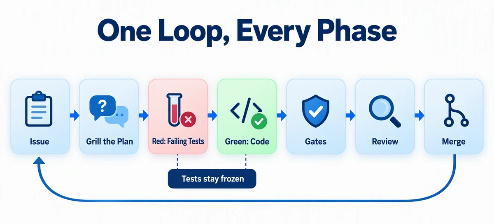
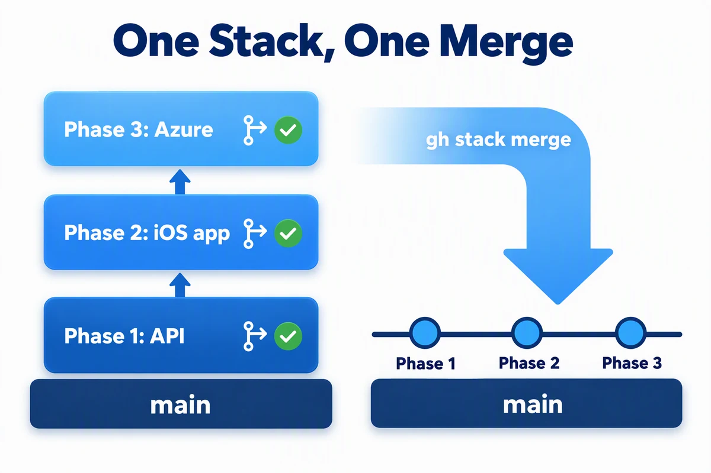
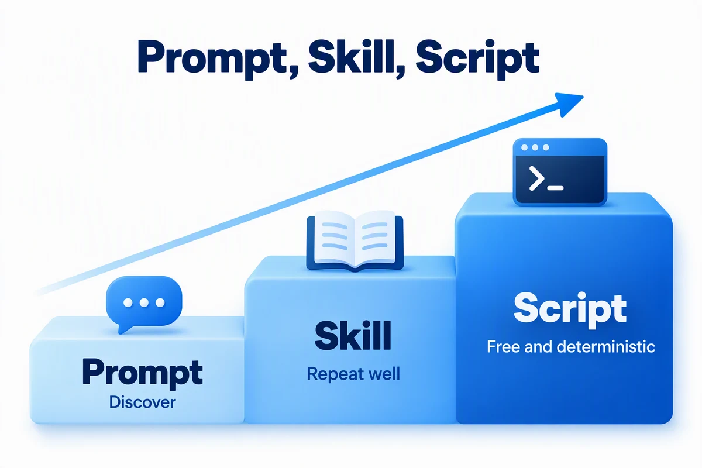
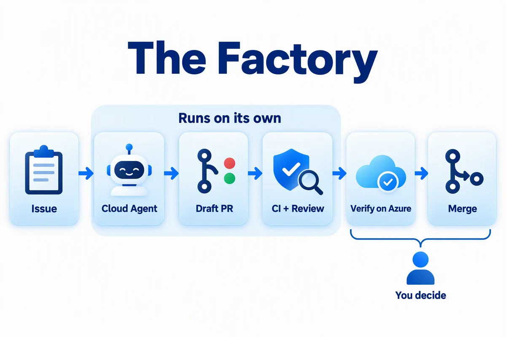

# SmartTodo - AI-Powered Task App

> ✨ **Build an iPhone app and its Azure backend the way teams ship with agents: issues first, a plan interview, failing tests before code, and gates that decide what ships.**

<p align="center">
  
</p>

You'll build SmartTodo, an iPhone app that turns a todo such as "Prepare conference talk" into steps you can check off. The API runs on Azure Functions, Azure SQL stores the data, and gpt-5-mini on Microsoft Foundry writes the steps.

Deploying is the easy part for an agent. Getting a result worth deploying is the hard part. So you won't paste large prompts and watch. You'll make the decisions, review the tests, and let commands with exit codes, not the agent's opinion, decide when work is done. At the end, you'll turn that loop into a factory that delivers the next feature from a GitHub issue.

## Learning Objectives

- Turn an architecture diagram into GitHub issues, and settle ambiguous requirements in a plan interview (`grill-plan`) before any code exists
- Drive an agent with red/green test-driven development (`tdd-builder` and `/autopilot`), and prove it didn't change the tests
- Gate every phase with commands that pass or fail: unit and contract tests, a black-box API verifier, iOS UI tests, an infrastructure check, and a deploy-and-verify step before risky pull requests merge
- Ship dependent work as a stack of pull requests with GitHub Stacked PRs (`gh stack`), required checks, and Copilot code review
- Review the architecture's cost with an agent, then deploy Azure Functions, Azure SQL with managed identity, and Microsoft Foundry with `azd`
- Capture what worked as a skill, a script that needs no AI, and a Copilot cloud agent setup that builds the next feature

> 💰 **Estimated Cost**: ~$10–30/month while the Azure resources exist, mostly Azure SQL and AI tokens, plus about 2,000–2,500 Copilot AI credits for the whole journey. Phases 0 to 2 create no Azure resources. Plan on 3–4 hours across a few sessions. About an hour of that is Phase 4's cloud agent working on its own, and you can [start at any phase](#short-on-time-start-at-a-later-phase). See [Cost Breakdown](#cost-breakdown), and run [Cleanup](#cleanup) when you finish.

## Prerequisites

| Host tool | Requirement | Purpose | Validation |
| --- | --- | --- | --- |
| [GitHub CLI](https://cli.github.com/) | Required | Issues, pull requests, and repository settings | `gh auth status` |
| [Git](https://git-scm.com/downloads) 2.20 or later | Required | Branches and worktrees | `git --version` |
| [`gh stack`](https://github.com/github/gh-stack) extension | Required | Stacked pull requests for Phases 1 to 3 | `gh stack --version` (install with `gh extension install github/gh-stack`) |
| [GitHub Copilot CLI](https://docs.github.com/en/copilot/how-tos/copilot-cli/cli-getting-started) | Required | Run the coding agent | `copilot --version` |
| [Node.js](https://nodejs.org/en/download) LTS or later | Required | API, scripts, hooks, and the verifier | `node --version` |
| [Azure Functions Core Tools](https://learn.microsoft.com/azure/azure-functions/functions-run-local#install-the-azure-functions-core-tools) v4 | Required | Run the API locally | `func --version` |
| [Azure CLI](https://learn.microsoft.com/cli/azure/install-azure-cli) | Required for Phase 3 | Bicep build and lint, and Azure sign-in | `az version` |
| [Azure Developer CLI (`azd`)](https://learn.microsoft.com/azure/developer/azure-developer-cli/install-azd) 1.28.0 or later | Required for Phase 3 | Preview, provision, and remove the deployment | `azd version` |
| Go-based [`sqlcmd`](https://learn.microsoft.com/sql/tools/sqlcmd/sqlcmd-download-install) | Required for Phase 3 | The post-provision hook creates the database user | `sqlcmd --version` |
| [Xcode](https://developer.apple.com/xcode/) 16 or later with an iOS simulator runtime | Required only to run Phase 2 on your machine | Build and test the SwiftUI app | `xcodebuild -version`, then `xcrun simctl list runtimes` shows an iOS runtime |

You also need a GitHub account, an Azure subscription, and a GitHub Copilot plan. Copilot code review and the Copilot cloud agent (Phase 4) need a plan that includes them. If yours doesn't, each of those steps gives an alternative, and every gate still runs.

**Before you start:**

1. Run every validation command in the table, and stop to install anything that fails. The [cross-platform installation guide](../../docs/tool-installation.md) has Windows, Mac, and Linux options.
2. Run `git config --global rerere.enabled true`, so Git remembers conflict resolutions when the stack rebases.
3. Inside `copilot`, install the Azure Skills plugin with `/plugin marketplace add microsoft/azure-skills`, then `/plugin install azure@azure-skills`.
4. Optional: install GitHub's `gh-stack` agent skill so Copilot knows the stack commands: `gh skill install github/gh-stack gh-stack --agent github-copilot --scope user`.
5. On a Mac, if `xcrun simctl list runtimes` shows no iOS runtime, run `xcodebuild -downloadPlatform iOS` (about 8 GB).
6. Before Phase 3, confirm that `az account show --output table` shows the subscription you intend to use.

> [!IMPORTANT]
> **Platform gate:** Every phase works on Windows, Mac, and Linux except running the iOS app. On Windows or Linux, you can still generate the SwiftUI app in Phase 2. The `ios` CI check runs its tests on a GitHub-hosted macOS runner.

> [!NOTE]
> GitHub Copilot CLI is the documented and validated command-line path. For another agentic coding tool, run: **"Copy or adapt this repository's `.github/skills` and `.github/agents` into your supported locations, preserving their behavior and reporting anything unsupported."**

### Acceptance criteria

You're done when:

- [ ] The API, iOS, and Azure issues are closed by pull requests merged into `main`
- [ ] The verifier prints its `PASS` line against the local API and against Azure
- [ ] The iOS tests pass: `node scripts/test-ios.mjs` on a Mac, and the `ios` check on every pull request
- [ ] `node scripts/check-infra.mjs` passes, and the scaffold proof passes with no AI involved
- [ ] The cloud agent's due-dates pull request merged through the same gates
- [ ] After [Cleanup](#cleanup), `az group exists --name <resource-group-name>` returns `false`

---

## Architecture

<p align="center">
  
</p>

Phase 3 deploys the backend in the diagram to one resource group. `azd` doesn't deploy the iPhone app: you run it in the simulator or on a device and point it at the deployed API.

---

## The Spec

SmartTodo is defined by a small set of linked plans. The agent reads them, and each prompt names the section that matters. Skim [`PLAN.md`](./PLAN.md) before you start; you don't need to read the phase plans end to end.

| Phase | Plan | You'll use it for |
| --- | --- | --- |
| 0. Plan the work | [`PLAN.md`](./PLAN.md) | Issues, quality gates, CI, repository rules, and the pull request stack |
| 1. API test-first | [`PLAN-phase1-api.md`](./PLAN-phase1-api.md) | API contracts, Decision Points, and the test strategy |
| 2. iOS from mockups | [`PLAN-phase2-ios.md`](./PLAN-phase2-ios.md) and [`images/mockups/`](./images/mockups/) | Screens, the API client, and iOS tests |
| 3. Azure with gates | [`PLAN-phase3-azure.md`](./PLAN-phase3-azure.md) | Cost review, infrastructure contract, and the infrastructure gate |
| 4. The factory | [`PLAN-phase4-factory.md`](./PLAN-phase4-factory.md) | Definition of done, the cloud agent, and the release pipeline |

---

## How This Journey Works

Every phase runs the same loop:

<p align="center">
  
</p>

| You | The agent |
| --- | --- |
| Answer the plan interview questions | Asks the questions and records the decisions on the issue |
| Read the test names and fix what's missing | Writes the failing tests and the code that makes them pass |
| Run the gate commands and believe only their exit codes | Runs the same gates before it says it's done |
| Triage review findings | Fixes them through another red/green loop |

### How Agentic AI is Used

Each of these tools does a job you'd otherwise do by hand:

| Where | Tool | What it does in this journey |
| --- | --- | --- |
| Copilot CLI | `@file` and `#issue` mentions | Attach the diagram and mockups, and point prompts at issues and pull requests |
| Copilot CLI | [`grill-plan`](../../.github/skills/grill-plan/SKILL.md) skill | Interviews you about the plan's Decision Points and posts the decisions to the issue |
| Copilot CLI | [`tdd-builder`](../../.github/agents/tdd-builder.agent.md) custom agent | Writes failing tests (red), then code that passes them (green), without changing the tests |
| Copilot CLI | `/autopilot` | Keeps working until the objective passes; `/plan` and `/fleet` split work across subagents (optional) |
| Copilot CLI | `/review` and `/rubber-duck` | Local code review and a second opinion before you open a pull request |
| Copilot CLI | Azure Skills plugin | Pricing, Bicep schemas, and deployment checks for the cost review and the infrastructure |
| GitHub | Rulesets, CI, and Copilot code review | Block the merge until the checks pass and the review threads are resolved |
| GitHub | Stacked pull requests (`gh stack`) | Keep three dependent phases reviewable as separate pull requests |
| GitHub | Copilot cloud agent with `copilot-setup-steps.yml` | Delivers a feature from an issue in its own sandbox, through the same gates |
| Your repository | Skills, scripts, and an agentic workflow | Turn what worked into something repeatable, then automatic |

Prompts that say "Use the tdd-builder agent" or "Use the grill-plan skill" load them from `.github/agents` and `.github/skills`; `/agent` and `/skills` list what's available. Run shell commands such as `gh stack` in a second terminal, or inside Copilot with a `!` prefix (`!gh stack view`). The app itself uses AI too: gpt-5-mini breaks each goal into steps, with an explicit output format and defensive parsing.

### The workflow

**Phases 1 to 3 are one stack of pull requests.** They depend on each other, so they ship as a [GitHub stack](./PLAN.md#stacked-pull-requests):

<p align="center">
  
</p>

Each pull request shows only its own phase's changes, and you can start the next phase while the last one is in review. `gh stack` creates the layers, opens their pull requests, and merges them. Phase 4 uses ordinary pull requests.

**Each red phase is tagged** (`phase1-red`, `phase2-red`, `phase3-red`), and each green gate runs `git diff --exit-code <tag>` on the tests. If that diff fails, the agent changed a test, so read it. If the test was wrong, commit only the test change as a new red commit, move the tag with `git tag -f <tag>`, and commit the code as green. If the test was right, restore it with `git checkout <tag> -- <file>` and ask the agent to fix the code.

Steps marked 🐙 use GitHub.com features and need your own repository.

**Which model?** Use a frontier model for the plan interview, the red phases, and infrastructure (`/model` switches it). Smaller models are often enough for green phases, because the tests tell them exactly when they're done. Check spending with `/usage`. To cap it, add `--max-ai-credits <n>` after `/autopilot`, set a session limit with `/limits`, or start with `copilot --max-ai-credits <n>`.

**Without Copilot code review:** run the setup script with `--no-copilot-review`, and run `/review` before you open each pull request instead. Triage its findings with the same rules. Everything else is unchanged.

<details>
<summary><strong>When something fails</strong></summary>

AI code generation isn't deterministic, so expect an occasional failure. If a prompt stops on a network error, run `/resume`, pick the session, and say "continue". For a failed command, stay in the same Copilot session, remove secrets from the output, and use this prompt:

```text
The following command failed during <journey phase> on <OS and shell>:

<exact command>

Relevant error output:

<redacted error output>

Inspect the relevant application and Azure logs, explain the root cause,
make the smallest safe fix, rerun the failed step, and run the phase gate.
Note the problem and fix for the pull request's "Problems and fixes"
section. Do not print secrets.
```

</details>

### Short on time? Start at a later phase

Phases 1 to 3 take 30–45 minutes each, and Phase 4 about an hour and a half, most of it waiting for the cloud agent. To start at a later one, run the setup script with `--start-at <phase>`. It puts the finished code of the earlier phases on `main` from the journey's [checkpoints](./PLAN.md#checkpoints), and every gate still applies to the phase you build. Create all the issues in Phase 0, and close the ones for phases you skipped.

| Start at | Before you begin |
| --- | --- |
| Phase 2 | Start the stack with `gh stack init --base main phase-2-ios` instead of Step 1. To try the app, run the local API as in Phase 1 Step 4, with `main` in place of `phase-1-api`. |
| Phase 3 | Start the stack with `gh stack init --base main phase-3-azure`. A stack with one pull request is an ordinary pull request to GitHub, so merge it with `gh pr merge <pr-number> --squash`. |
| Phase 4 | Deploy first: run Phase 3 Step 4 from `main`. |

---

## Phase 0: Plan the Work

### Step 1: Create the workspace and repository 🐙

The app gets its own workspace and GitHub repository, so this repository stays untouched. That setup is the same every time, so it's a script rather than a prompt. From this repository's root, run:

```text
node journeys/smart-todo/setup/setup.mjs
```

It copies the journey into `../smart-todo-workspace`, commits it, creates a public `smart-todo` repository with CI, protects `main` with a ruleset, and waits for the first CI run. Add `--private` for a private repository (rulesets there need GitHub Pro, Team, or Enterprise), `--no-copilot-review` if your plan doesn't include Copilot code review, or `--start-at <phase>` to [start at a later phase](#short-on-time-start-at-a-later-phase). `--help` lists every option.

**Gate:** The script ends with `Ruleset: active` and `CI on main: success`.

From now on, nothing reaches `main`, including the agent's work, without a pull request and green checks. Start a Copilot session in the workspace; you'll work from this directory for the rest of the journey:

```text
cd ../smart-todo-workspace/journeys/smart-todo
copilot
```

**💡 What you're learning:** Setup needs no judgment, so a script does it: free, in seconds, and the same every time. You'll turn infrastructure into a script the same way in Phase 3.

### Step 2: Turn the architecture into issues 🐙

Attach the diagram and let the agent break the work down:

```
> @images/architecture.png This is the SmartTodo architecture. Read PLAN.md,
  then create the issues described in its "Issue Breakdown" section. Show me
  each issue number and title.
```

Open the issues on GitHub. Note the numbers for Phase 1, 2, and 3. The prompts below call them `<api-issue>`, `<ios-issue>`, and `<azure-issue>`.

**💡 What you're learning:** Issues are shared memory. Decisions, pull requests, review comments, and known limitations attach to them, so the next session, teammate, or cloud agent starts with the same context you have.

---

## Phase 1: Build the API Test-First

<p align="center">
  
</p>

You'll build the Azure Functions API with Node.js and TypeScript. Locally, it uses an in-memory store and a fake AI generator, so this phase needs no database, no AI key, and no Azure resources.

### Step 1: Grill the plan

Create the stack with its first layer (in a second terminal, or with `!` in Copilot), then start the interview:

```text
gh stack init --base main phase-1-api
```

```
> Use the grill-plan skill on issue #<api-issue>. Read PLAN.md and
  PLAN-phase1-api.md first. When we finish, post the Decisions and the
  Test list as a comment on the issue.
```

Answer each question. Saying "use the defaults" is fine on your first run.

**💡 What you're learning:** Each question is a decision the agent would otherwise make silently, such as what happens when the model returns nine steps. The plan's [Decision Points](./PLAN-phase1-api.md#decision-points) make sure the questions that matter come up. Add a section like it to your own plans.

### Step 2: Red: write the failing tests

```
> Use the tdd-builder agent for the red phase of issue #<api-issue>.
  Scaffold src/api as described in the "Project Structure", "Local
  Providers", and "Quality Gate" sections of PLAN-phase1-api.md. Then write
  the tests from its "Test Strategy" section and the Decisions comment on
  the issue. Tag the red commit phase1-red.
```

Confirm the tests fail for the right reason:

```text
cd src/api
npm test
cd ../..
```

The failures must be assertions or `Not implemented` errors. Import or compile errors mean the red phase isn't done, so ask the agent to fix the setup.

**🔍 Review the tests, not code.** Read the Requirement → Test table the agent printed. Every interview decision needs a test, boundaries need both sides (500 characters passes, 501 fails), and fixtures must make sense: a pending todo whose only step is checked becomes `completed`, not `in_progress`. If something is wrong, fix it now, while it's cheap:

```
> The Decision Point 3 test gives the todo only one step, so completing it
  triggers auto-completion. Give the todo two steps and complete only the
  first. Keep it red. Amend the red commit and move the phase1-red tag.
```

**💡 What you're learning:** You're reviewing around forty test names instead of a thousand lines of generated code. A misunderstanding caught in a test name costs one sentence to fix.

### Step 3: Green: let the agent make them pass

Autopilot keeps working until the objective is met.

```
> /autopilot Use the tdd-builder agent for the green phase of issue
  #<api-issue>. Implement src/api until "npm run check" passes. Do not
  change anything under src/api/test. Commit the result as a green commit.
```

<details>
<summary>Optional: split the work across parallel agents with <code>/plan</code> and <code>/fleet</code></summary>

`/fleet` runs several subagents at once, each owning part of a plan. It shows how agents divide work, but costs about ten times more than autopilot here. Run `/plan Plan the green phase of issue #<api-issue> as independent tracks: data stores, AI, and HTTP handlers.`, review the plan, and **leave plan mode** (Shift+Tab) so the subagents can write files. Then run `/fleet Implement the plan with the tdd-builder agent's green-phase rules and commit the result as a green commit.`

</details>

**Gate:** Both commands must exit `0`:

```text
cd src/api
npm run check
cd ../..
git diff --exit-code phase1-red -- src/api/test
```

**💡 What you're learning:** The second command is why you can trust the first. An agent that's trying to make tests pass can "fix" the tests. The diff proves it didn't.

### Step 4: Prove it from the outside

Unit tests prove the pieces. The checked-in verifier proves the running API from outside, and you didn't let the agent write it.

Run the API from its own worktree, a second checkout of the repository, so it keeps running while you move between stack layers:

```text
git worktree add --detach ../../../smart-todo-api phase-1-api
```

1. In one terminal, from `smart-todo-api/journeys/smart-todo/src/api`, copy `local.settings.example.json` to `local.settings.json`, run `npm ci`, and start the storage emulator with `npm run azurite`.
2. In a second terminal, from the same folder, run `npm run build`, then `func start`. If port 7071 is in use, use `func start --port <port>` and that port below.
3. In a third terminal, from `smart-todo-workspace/journeys/smart-todo`, run:

```text
node ../../.github/scripts/verify-smart-todo.mjs --base-url http://localhost:7071
```

**Gate:** It prints `PASS: seed, validation errors, create, AI steps, auto-completion, reopen, delete, and final absence`.

Leave the API running for Phase 2. After a later fix to Phase 1, run `git checkout --detach phase-1-api` in the API worktree and restart `func start`.

### Step 5: Review before you open the pull request

```
> /review Review the phase-1-api branch against PLAN-phase1-api.md and the
  Decisions comment on issue #<api-issue>. Report only correctness,
  security, and contract issues.
```

Decide what to do with each finding, then hand it back in the same session, so the agent still has the findings:

```
> Triage these /review findings with the "Review Triage" section of
  PLAN.md: fix <numbers>, file <number> as a known-limitation issue.
```

The agent writes each fix as a new red commit (moving the `phase1-red` tag), then a green commit. For a second opinion, run `/rubber-duck`.

### Step 6: Ship through the gate 🐙

```
> Open the pull request for this stack layer with gh stack submit --auto
  --open. Then edit it: title it "Phase 1: API", and make the description
  close #<api-issue> and include the gate results. Don't merge it.
```

Watch the checks with `gh pr checks --watch`. Copilot code review posts one review a few minutes after the pull request opens (`gh pr view --json reviews`). Wait for it: its comments only block the merge once they exist. Start Phase 2 in the meantime. When the review arrives, read it, then hand it to the agent between Phase 2 prompts, not while one is running, because both work in the same checkout:

```
> Handle the Copilot code review on pull request #<pr-number> with the
  triage procedure in the "Review Triage" section of PLAN.md.
```

Copilot reviews each pull request once, so there's no second round. **Leave the pull request open** when its checks are green and its threads are resolved. The whole stack merges at the end of Phase 3 in one command. Merging this layer early would point the next layer's pull request at `main`, which starts a Copilot review you don't need.

**💡 What you're learning:** Each reviewer finds things the others miss: tests catch contract bugs, `/review` catches gaps in the plan, and Copilot code review caught a model parameter that gpt-5-mini rejects in production. Layers of review pay off. Extra rounds don't, because each one finds something new in the last fix.

---

## Phase 2: Build the iOS App from Mockups

<p align="center">
  
</p>

This phase starts from [mockups](./images/mockups/smart-todo-mockups.png) instead of an architecture diagram. The starter app in [`starter/ios`](./starter/ios) already has the todo list, adding a todo, the API client, and their tests, so you'll build the screen where the AI lives: the Todo Detail screen, where you generate steps and check them off. The tests run against an in-app fake client, so they need no running API.

> **New to Swift?** `Codable` handles JSON like TypeScript interfaces, `async/await` works as in JavaScript, and `#if DEBUG` is a compile-time flag. XCTest runs unit tests, and XCUITest drives the app in a simulator the way a person would.

### Step 1: Add the iOS layer to the stack

From the top of the stack, add the next layer. It starts from the Phase 1 code:

```text
gh stack top
gh stack add phase-2-ios
```

### Step 2: Grill and red from the mockups

```
> @images/mockups/todo-detail-empty.png @images/mockups/todo-detail-steps.png
  These are the SmartTodo detail screen mockups. Use the grill-plan skill on
  issue #<ios-issue> with PLAN-phase2-ios.md, and post the decisions to the
  issue.
```

```
> Use the tdd-builder agent for the red phase of issue #<ios-issue>. Copy
  starter/ios to src/ios as the "Project Layout" section of
  PLAN-phase2-ios.md describes, then write the tests from its "Test
  Strategy" section. Tag the red commit phase2-red.
```

On a Mac, run `node scripts/test-ios.mjs --check-starter`. The build must succeed, the starter's tests must pass unchanged, and the new ones must fail. Compare the UI test's steps with the mockups, and check that each Decision Point has a test.

### Step 3: Green

```
> /autopilot Use the tdd-builder agent for the green phase of issue
  #<ios-issue>. Build the Todo Detail screen from the mockups and
  PLAN-phase2-ios.md until "node scripts/test-ios.mjs" passes. Do not
  change the test targets or scripts/test-ios.mjs. Commit the result as a
  green commit.
```

**Gate (Mac):** All three commands must exit `0`:

```text
node scripts/test-ios.mjs --check-starter
git diff --exit-code phase2-red -- src/ios/SmartTodoTests src/ios/SmartTodoUITests
git diff --exit-code main -- scripts/test-ios.mjs starter/ios
```

The first runs the tests and proves the starter's own tests are still intact, the second proves the green phase didn't change the new tests, and the third proves nobody touched the test runner or the starter.

On Windows or Linux, skip to Step 5. The `ios` CI check runs the tests on a macOS runner.

### Step 4: Try it

Open `src/ios/SmartTodo.xcodeproj` in Xcode, select an iPhone simulator, and run it (⌘R) against the local API from Phase 1. In Xcode 27 and later, the simulator window is in the **Device Hub** app. Add "Plan a weekend camping trip", generate steps, check them all off, and confirm the list shows `completed`.

The UI test proves the flow someone scripted; exploratory testing finds what nobody did. Change the simulator's appearance and text size, relaunch, and look:

```text
xcrun simctl ui booted appearance dark
xcrun simctl ui booted content_size accessibility-extra-extra-large
xcrun simctl io booted screenshot smart-todo-dark-xxl.png
```

Try a very long title and a todo with seven steps too. Restore the defaults with `appearance light` and `content_size large`. When you find a real bug, turn it into an XCUITest first, then fix it.

<details>
<summary>Optional: let Computer Use inspect the app</summary>

Computer Use lets an agent read the running app's accessibility tree and screenshots. It needs an interactive session and Accessibility and Screen Recording permissions for the **Copilot Computer Use** helper app. Run `/computer`, then ask: `Inspect SmartTodo in Device Hub and report layout problems, truncated text, and differences from the mockups, with screenshots. Do not change code.` In Xcode 27 it can read the simulated app but not tap or type into it, so put the app in each state yourself. Its results vary, so it isn't a gate.

</details>

### Step 5: Ship the iOS layer 🐙

```
> Open the pull request for this stack layer with gh stack submit --auto
  --open. Then edit it: title it "Phase 2: iOS app", and make the
  description close #<ios-issue>. Don't merge it.
```

The pull request's base is `phase-1-api`, so it shows only the iOS changes, and GitHub shows both pull requests as one stack. Phases 2 and 3 skip Copilot code review to save time; you ran the full review loop in Phase 1. To get one anyway, run `gh pr edit <pr-number> --add-reviewer @copilot` and triage it with the Phase 1 prompt.

Leave this pull request open too; it merges with the rest of the stack in Phase 3.

---

## Phase 3: Deploy to Azure with Gates

<p align="center">
  
</p>

Start once the iOS layer's pull request is open. Add the Azure layer on top of the stack:

```text
gh stack top
gh stack add phase-3-azure
```

### Step 1: Ask what it costs and how to make it better

```
> Do the "Cost and Architecture Review" in PLAN-phase3-azure.md for issue
  #<azure-issue>. This is read-only. Do not change files or post anything.
```

Adopt at most one improvement on your first run; the defaults work. Have the agent add it to `PLAN-phase3-azure.md` first, because the generator, the gate, and the review all read the plan. Then post your decisions:

```
> Post the cost estimate and my decisions as a comment on issue #<azure-issue>.
```

**💡 What you're learning:** Agents are very good at cloud trade-offs. You still own the decision, and the plan records it.

### Step 2: Red: write the infrastructure gate first

```
> Create scripts/check-infra.mjs exactly as the "Infrastructure Gate"
  section of PLAN-phase3-azure.md specifies. Run it with --offline and show
  me that it fails because the infrastructure doesn't exist yet. Commit it
  and tag the commit phase3-red.
```

**💡 What you're learning:** You just turned the plan's list of deployment gotchas into a program. Every rule an earlier deployment learned the hard way is now checked in seconds, for free, before anything reaches Azure.

### Step 3: Green: generate infrastructure until the gate passes

```
> /autopilot Generate the infrastructure in the "Azure Deployment" section
  of PLAN-phase3-azure.md until "node scripts/check-infra.mjs --offline"
  passes. Do not change scripts/check-infra.mjs.
```

**Gate:** Both commands must exit `0`:

```text
node scripts/check-infra.mjs --offline
git diff --exit-code phase3-red -- scripts/check-infra.mjs
```

Read the infrastructure diff too. A gate only works if it checks what actually deploys, so watch for changes that satisfy a rule without changing the resource it describes.

### Step 4: Preview, deploy, and verify

Have `azd` reuse your Azure CLI sign-in, then let the agent prepare the environment: provider registration, your subscription and principal, the region, and the model version.

```text
azd config set auth.useAzCliAuth true
```

```
> Prepare this azd environment as the "Environment Preparation" section of
  PLAN-phase3-azure.md describes. Don't run azd up.
```

To set the values yourself instead, use the commands in [Environment Preparation](./PLAN-phase3-azure.md#environment-preparation). Then run the full gate, which adds an Azure preview. The preview deploys nothing, but `azd` creates the empty, tagged resource group, which `azd up` then uses and [Cleanup](#cleanup) deletes:

```text
node scripts/check-infra.mjs
```

When it passes, deploy. Run this yourself so you can watch its output:

```text
azd up
```

`azd up` ends with the post-provision hook, which creates the database user for the Function App's SQL identity and prints `Post-provision SQL setup complete.` The API creates its own tables and seed data on its first request. Some `azd` versions hide hook output, so if you don't see that line, run `node infra/hooks/postprovision.js`; it's safe to rerun. If it fails, use the "When something fails" prompt.

Confirm that the hook removed its temporary firewall rule. Only `AllowAzureServices` should remain. Use the resource group from `azd env get-value RESOURCE_GROUP_NAME` and the part of `azd env get-value SQL_SERVER_NAME` before the first dot:

```text
az sql server firewall-rule list --resource-group <resource-group> --server <sql-server> --query "[].name" --output tsv
```

**Gate:** The same verifier from Phase 1, now pointed at Azure:

```text
node ../../.github/scripts/verify-smart-todo.mjs
```

It reads `API_URL` through `azd` and must print the same `PASS` line as before. This time the steps come from gpt-5-mini.

### Step 5: Point the iOS app at Azure (Mac)

Get the URL with `azd env get-value API_URL`, set `Config.apiBaseURL` to it, and run the app in the simulator. Generate steps for a real goal and compare them with the fake ones.

### Step 6: Make it repeatable

```
> Create the skill in the "Reusable Infrastructure Skill" section and the
  script in the "Deterministic Scaffold" section of PLAN-phase3-azure.md.
  Then run the scaffold proof from that section.
```

**Gate:** The scaffold proof passes: a fresh copy passes `check-infra.mjs --offline` with no AI involved.

**💡 What you're learning:** Knowledge moves up a ladder as it proves itself:

<p align="center">
  
</p>

Use a prompt to discover how to do something. It costs AI credits and your attention, and the result varies. A skill (`SKILL.md`) repeats it well, because the agent starts with the lessons. A script (`scaffold-infra.mjs` and `check-infra.mjs`) is free, runs in seconds, and gives the same result every time, so use one once the result stops changing.

### Step 7: Ship 🐙

Optionally, run `/security-review` first. It reviews uncommitted changes, which at this point are the infrastructure, the hook, and the scripts.

```
> Commit the infrastructure, skill, and scripts. Open the pull request for
  this stack layer with gh stack submit --auto --open. Then edit it: title
  it "Phase 3: Azure deployment", and make the description close
  #<azure-issue> and include the verifier's PASS line. Don't merge it.
```

When the checks are green on all three pull requests, merge the whole stack from the top:

```text
gh stack merge <pr-number> --yes --squash
gh stack sync --prune
```

`gh stack merge` lands this pull request and every layer below it, each as its own squash commit on `main`, and merges nothing unless every layer meets every rule. `gh pr merge` and auto-merge can't merge stack layers. `gh stack sync --prune` then deletes the merged branches. From now on, every pull request that changes `src/api` or `infra` also passes [Verify Before Merge](./PLAN.md#verify-before-merge): deploy the branch, run the verifier, and paste the `PASS` line.

---

## Phase 4: Build the Factory

<p align="center">
  
</p>

You ran the same loop three times by hand: issue, interview, red, green, gates, review, merge. Now you'll write that loop down so the next feature runs through it without you driving every step. Phase 4 uses ordinary pull requests, so start from `main` once all three stack layers have merged:

```text
git switch main
git pull
git switch -c phase-4-factory
```

### Step 1: Write down the definition of done

```
> Create .github/copilot-instructions.md and
  .github/workflows/copilot-setup-steps.yml as described in the "Definition
  of Done" and "Cloud Agent Environment" sections of PLAN-phase4-factory.md.
  Open a pull request. Don't enable auto-merge.
```

Triage the Copilot code review as before, then enable auto-merge. After it merges:

1. Run `gh workflow run copilot-setup-steps.yml` and confirm it succeeds with `gh run list --workflow copilot-setup-steps.yml`.
2. In the repository's **Settings**, open **Copilot** → **Cloud agent** and turn off **Require approval for workflow runs**, so CI runs on the agent's pushes without you approving each one. It's safe here because `ci.yml` uses no secrets.

### Step 2: Hand an issue to the cloud agent 🐙

```
> Create the issue in the "Feature Issue: Due Dates" section of
  PLAN-phase4-factory.md and show me its URL.
```

The cloud agent branches from `main` when you assign it, so confirm that `git log --oneline origin/main` shows all three phases first. On GitHub, open the issue, select **Assignees**, choose **Copilot**, select the **tdd-builder** agent, and assign it. The agent works in a sandboxed GitHub Actions environment built by your setup steps. It opens a **draft** pull request right away and runs the full cycle there: plan update, red commit, then green commits. It usually takes 15–25 minutes, and the pull request timeline shows when it's done.

To assign from the command line instead, see [Assign the Cloud Agent](./PLAN-phase4-factory.md#assign-the-cloud-agent).

You can also hand work to the cloud agent from the CLI: `/delegate` sends your current session to GitHub, and Copilot opens a pull request from it. Assigning the issue is the better fit here, because it starts from the issue's full description.

**Without the cloud agent:** create a worktree for the issue and run the tdd-builder agent's full cycle locally: `Use the tdd-builder agent for the full cycle of issue #<number>.` Then ship it through the same pull request steps.

### Step 3: Be the reviewer

1. Read the red commit's test names, which the agent lists in the description. Did it understand the issue?
2. When a check fails, paste the error line from the check log into a `@copilot` comment. The agent can't build Swift in its Linux environment, so the `ios` check is how it learns the app doesn't compile.
3. Select **Ready for review** (`gh pr ready <number>`); a draft can't merge, and Copilot code review starts only after the pull request leaves draft. Remove the `[WIP]` prefix from the title, because the squash commit on `main` uses it.
4. Triage the Copilot code review. Put every fix in one `@copilot` comment so the agent pushes once.
5. Run [Verify Before Merge](./PLAN.md#verify-before-merge): `gh pr checkout <number>`, `azd deploy api`, and the deployed verifier. On a Mac, also run `node scripts/test-ios.mjs` and the app from the branch. CI runs in UTC, so a time-zone bug in date code passes the `ios` check and fails on your Mac.
6. The agent replies to review threads but doesn't always resolve them. Check each fix, resolve its thread, then approve the pull request and enable auto-merge.

### Step 4 (optional): Ship on merge

```
> Set up the "Release Pipeline (Optional)" in PLAN-phase4-factory.md. Stop
  and ask me before creating any Azure identity or granting any role.
```

Merge any small change and watch the release run end with the verifier's `PASS` line. Schema changes such as due dates ship with the code, because the API applies its migrations at startup.

### What you built

| What you did by hand | What does it now |
| --- | --- |
| Broke the architecture into work | Issues and sub-issues |
| Decided the ambiguous parts | The `grill-plan` skill and each plan's Decision Points |
| Wrote tests first and kept them fixed | The `tdd-builder` custom agent |
| Checked that it works | `ci.yml` gates and the checked-in verifier |
| Kept dependent work reviewable | A stack of pull requests (`gh stack`) |
| Checked that it's safe to merge | The ruleset, Copilot code review, and `gh stack merge` or auto-merge |
| Set up the agent's machine | `copilot-setup-steps.yml` |
| Remembered how to deploy | The infrastructure skill, `scaffold-infra.mjs`, and `check-infra.mjs` |
| Deployed | `release.yml` (optional) |

The next step is a factory that runs without anyone starting it. This repository has one for its own journeys: [`journey-e2e-test.md`](../../.github/workflows/journey-e2e-test.md) is an agentic workflow that runs a journey end to end and files a report.

---

## Cost Breakdown

**Azure (while the resources exist):**

| Resource | SKU | Monthly Cost |
|----------|-----|--------------|
| Azure Functions | Flex Consumption (scale to zero) | ~$0-5 |
| Azure SQL Database | Basic (5 DTU) | ~$5 |
| Microsoft Foundry (AIServices) | Pay-per-token (gpt-5-mini) | ~$1-10 |
| Application Insights | Pay-per-GB | ~$0-5 |
| Log Analytics | Pay-per-GB | ~$0-5 |
| Storage Account | Standard LRS | ~$1 |
| **Total** | | **~$10-30/month** |

**Copilot (the whole journey, with a frontier model):** about 2,000–2,500 AI credits in local sessions, measured in the last validation run: roughly 50 for Phase 0, 800 for Phase 1 (2,000 with the optional `/fleet`), 400 for Phase 2, 650 for Phase 3, and 100 for Phase 4, plus the cloud agent's own sessions. Review triage and the red phases are the largest costs. Cap a run with `/autopilot --max-ai-credits <n>`, or a session with `/limits`.

**GitHub Actions:** free for public repositories on standard runners. For private repositories, macOS minutes (the `ios` check) count at a higher rate than Linux and Windows minutes. The Copilot cloud agent uses Actions minutes too.

---

<details>
<summary>Troubleshooting</summary>

## Troubleshooting

| Symptom | Cause and fix |
| --- | --- |
| A required check says "Expected — Waiting for status to be reported" | A job named `api`, `ios`, or `infra` never ran, usually because of a `paths` filter or a renamed job. Every job must always run and succeed when its area doesn't exist yet ([Continuous Integration](./PLAN.md#continuous-integration)). |
| The pull request merged before Copilot code review posted | Auto-merge was on when the pull request opened. Handle the late comments in a follow-up pull request, and enable auto-merge only after the review from now on. |
| A pull request shows "no checks reported" | It conflicts with `main`, and GitHub doesn't run workflows on a conflicting pull request. Merge `origin/main`, resolve, and push (or ask `@copilot` to). |
| Checks never start on the cloud agent's pull request | Turn off **Require approval for workflow runs** (Settings → Copilot → Cloud agent), or run `gh run rerun <run-id>` for the run whose conclusion is `action_required`. |
| `gh pr merge` or auto-merge fails on a stack layer | Stack layers merge with `gh stack merge <pr-number> --yes --squash`, which also merges the unmerged layers below it. |
| A layer shows "needs rebase", or the stack merge reports a non-linear history | A lower layer or `main` moved. Run `gh stack sync`, or `gh stack rebase` and then `gh stack push`. On a conflict, resolve it and run `gh stack rebase --continue`. |
| You want Copilot review on the Phase 2 or Phase 3 layer | The ruleset requests it only for pull requests whose base is `main`. Run `gh pr edit <pr-number> --add-reviewer @copilot`. |
| `gh stack submit` warns `Could not create stack: Pull request #<n> is merged` | A lower layer merged before the layers above it had pull requests. Link the open ones into a stack with `gh stack link <pr-number> <pr-number>`, bottom first, then merge from the top. |
| `gh stack submit` exits with code 9 | Stacked pull requests aren't available for the repository (the feature is in public preview). Open ordinary pull requests with the same bases, and merge them from the bottom up. |
| The Functions host stops when you switch branches | Run the API from the detached API worktree, not the stack checkout. |
| `setup.mjs` says the ruleset isn't enforced | Rulesets on private repositories need GitHub Pro, Team, or Enterprise. Make the repository public and rerun with `--resume`, or rerun with `--resume --allow-unprotected` to continue knowing the gates don't block merging. |
| The red phase fails with import or compile errors | Ask the agent for stubs that throw `Not implemented`, so tests compile and fail on assertions. |
| `xcodebuild` can't find tests, or a new Swift file isn't compiled | Start from `starter/ios`, whose synchronized folders include every file in each target folder and whose shared scheme includes both test targets. Don't edit `project.pbxproj`. |
| `setup.mjs` stops partway, or says the workspace or repository already exists | After a failure on GitHub, fix the cause and rerun with `--resume`. To start over, remove `../smart-todo-workspace` and delete the repository, or pass a new `--workspace <path>` and `--repo <name>`. |
| Functions finds no functions locally | `"main"` in `package.json` must be `"dist/functions/*.js"`, and run `npm run build` before `func start`. |
| The Function App returns 500 on database calls | The managed identity lacks database access, or `AZURE_SQL_SERVER` isn't the full `<sql-name>.database.windows.net` name. Rerun `node infra/hooks/postprovision.js` as the Microsoft Entra administrator. |
| AI step generation returns 503 in Azure | Check that `AI_PROVIDER=foundry` and the `AZURE_AI_*` settings exist (without printing values), and that the request uses `max_completion_tokens`, not `max_tokens`. |
| A soft-deleted Cognitive Services account blocks redeployment | `az cognitiveservices account list-deleted`, then `az cognitiveservices account purge --name <name> --resource-group <rg> --location <location>`. |
| `azd deploy` fails during the Oryx TypeScript build | Don't exclude `src/` or `tsconfig.json` in `.funcignore`, and remove `azure-functions-core-tools` from `package.json` if the agent added it; `func` is a host tool. |
| The iOS app can't reach the API | Locally, the API must run on `localhost:7071`. For Azure, `Config.apiBaseURL` must match `azd env get-value API_URL`, use `https://`, and have no trailing slash. |
| The `ios` check fails in CI but passes on your Mac | GitHub's macOS runners are much slower than a Mac. Read the assertion line that `test-ios.mjs` prints. If a UI test couldn't find an element, check that the screen is a `ScrollView`, not a lazy `Form` or `List`, and that every wait is at least 10 seconds ([Test Strategy](./PLAN-phase2-ios.md#test-strategy)). Each caused CI-only failures in validation runs. |
| The simulator says the application failed preflight checks | Uninstall SmartTodo from the simulator, restart it, run **Product > Clean Build Folder**, and launch again. |
| The first request after idle takes 5–10 seconds | Expected: Flex Consumption scales to zero, and the first request after a deployment also applies database migrations. |

</details>

---

## Verification Checklist

The journey is complete when every [acceptance criterion](#acceptance-criteria) is met. Each phase lists its gate commands, and [Quality Gates](./PLAN.md#quality-gates) collects them with the directory each one runs from.

---

## Cleanup

> [!CAUTION]
> This procedure permanently deletes the Function App, SQL database, Microsoft Foundry resource, and all journey data.

Stop the local API and the storage emulator (Ctrl+C in their terminals). Then read and save the resource group name, and remove the Azure resources from `journeys/smart-todo`:

```text
azd env get-value RESOURCE_GROUP_NAME
azd down --force --purge
```

Confirm that `az group exists --name <resource-group-name>` returns `false`. If cleanup reports a soft-deleted Cognitive Services resource, purge it as described in [Troubleshooting](#troubleshooting).

Remove the API worktree with `git worktree remove ../../../smart-todo-api`. If you set up the release pipeline, also delete its recorded role assignments, then the identity resource group whose name you recorded during setup, then the repository variables, as the [Release Pipeline](./PLAN-phase4-factory.md#release-pipeline-optional) cleanup describes. Keep or delete the GitHub repository as you prefer.

---

<details>
<summary>Lessons from validation runs</summary>

## Lessons from Validation Runs

This journey was run end to end six times before publishing. Each rule below exists because a run broke without it.

- **Auto-merge before review merged unreviewed code.** A pull request merged four minutes before Copilot's review posted four real findings. Hence: wait for the review, and require conversation resolution.
- **Review rounds multiplied.** Every push started a new review, and each round found something in the last fix. Three rounds on one pull request cost more than the implementation. Hence: one round, one push.
- **Agents edit tests when stuck.** Autopilot started a second pass that changed two tests after the first pass refused to. Both edits happened to be right, but only the diff gate showed they happened.
- **Agents game gates.** One couldn't satisfy an infrastructure rule, so it added a metadata field containing the expected text. The gate now checks only deployable resources.
- **Local fakes hide production bugs.** gpt-5-mini rejected `max_tokens`, a SQL date was bound as a string, and a schema change shipped before its column existed. None of them showed up with the fake AI and the in-memory store. Hence: boundary tests and Verify Before Merge.
- **Cleanup must survive failure.** The deployment hook left a temporary SQL firewall rule open twice, once from an unsupported flag and once from a crash right after creating it.
- **Timing matters for the cloud agent.** An issue assigned before Phase 2 merged made the agent rebuild the iOS app, and every Swift file conflicted.
- **Building the whole iOS app took longest.** The green phase ran 48 to 88 minutes. Hence: a starter app with everything except the detail screen.
- **Review time added up.** Triage took 15 to 30 minutes on each stack layer. Hence: one full review loop in Phase 1, and gates alone for Phases 2 and 3.
- **A fix renamed a live resource.** A reviewer flagged an App Service plan name that could exceed 40 characters. The first fix changed the name for every environment, and the redeploy created a second plan next to the running one. Hence: never rename a deployed resource, and read the preview for an unexpected `Create`.
- **One SQL batch hid a schema bug until deployment.** The API sent every migration and seed insert as one batch, so the seed's new column failed to compile before the migration that adds it could run, and the whole API returned 404. Every local test passed; Verify Before Merge caught it. Hence: one request per migration, and connect to the database on the first request, not while the module loads.
- **Merging the bottom layer early broke the stack.** The next layer's pull request moved to `main`, got an unplanned Copilot review, and GitHub couldn't create the stack because its bottom pull request was already merged. Hence: merge the whole stack once, from the top.
- **A lazy form hid the UI test's target.** The detail screen was a SwiftUI `Form`, which only builds the rows on screen. After the due-date controls pushed the steps down, the UI test failed about one CI run in eight and never locally. Hence: a `ScrollView` for the detail screen, and 10-second waits.
- **Plan mode blocks writes.** `/fleet` launched while the session was still in plan mode; three subagents designed everything and wrote nothing.

</details>

---

## Assignment

1. **Improve the AI through the factory.** Write an issue asking for time estimates in each generated step, and assign it to the cloud agent. How did the agent test a prompt change without calling the real model?
2. **Try a different model.** Switch the Foundry deployment to gpt-4.1, generate steps for the same todo with each model, and compare quality and latency.
3. **Observe the app.** Ask Copilot to query Application Insights for request counts, failures, and the slowest endpoint over the last hour, and to show the KQL it used.
4. **Harden security.** Pick one: move `AZURE_AI_KEY` to Key Vault, switch AI to managed identity, add rate limiting to `generate-steps`, or require a function key. Each change starts with a plan update and a failing test. See [Production Hardening](./PLAN.md#production-hardening-out-of-scope).

---

## What's Next

- [AIMarket](../aimarket/README.md): a full-stack marketplace with AI Search and Foundry chat
- [Superset](../superset/README.md): an AKS deep dive
- Deploy an open-source app with `@oss-to-azure-deployer`
- Point your factory at your own idea: write a `PLAN.md` with Decision Points and Quality Gates, and start at Phase 0

> 📚 **All journeys:** [Back to root README](../../README.md#agentic-journeys)

---

## Resources

- [SmartTodo Plan](./PLAN.md) and the phase plans: [API](./PLAN-phase1-api.md), [iOS](./PLAN-phase2-ios.md), [Azure](./PLAN-phase3-azure.md), [Factory](./PLAN-phase4-factory.md)
- [Copilot CLI](https://docs.github.com/en/copilot/how-tos/use-copilot-agents/use-copilot-cli), [autopilot](https://docs.github.com/en/copilot/concepts/agents/copilot-cli/autopilot), and [/fleet](https://docs.github.com/en/copilot/concepts/agents/copilot-cli/fleet)
- [Creating custom agents](https://docs.github.com/en/copilot/how-tos/copilot-on-github/customize-copilot/customize-cloud-agent/create-custom-agents)
- [Configuring settings for the Copilot cloud agent](https://docs.github.com/en/copilot/how-tos/use-copilot-agents/cloud-agent/configuring-agent-settings)
- [About rulesets](https://docs.github.com/repositories/configuring-branches-and-merges-in-your-repository/managing-rulesets/about-rulesets)
- [Flex Consumption](https://learn.microsoft.com/azure/azure-functions/flex-consumption-plan), [Azure SQL managed identity](https://learn.microsoft.com/azure/azure-sql/database/authentication-aad-configure), [Azure Verified Modules](https://azure.github.io/Azure-Verified-Modules/indexes/bicep/), and [Azure Developer CLI](https://learn.microsoft.com/azure/developer/azure-developer-cli/)
- [SwiftUI tutorials](https://developer.apple.com/tutorials/swiftui)
