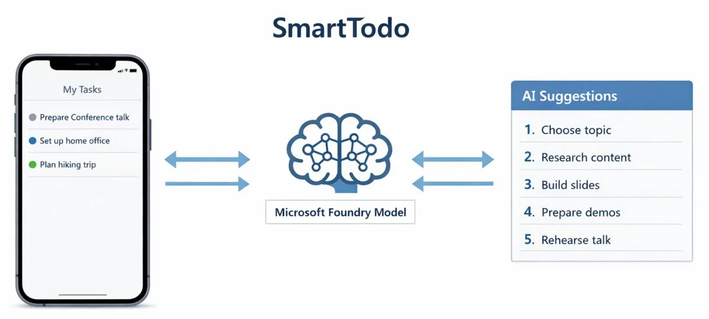
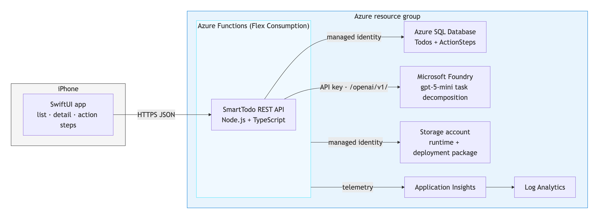
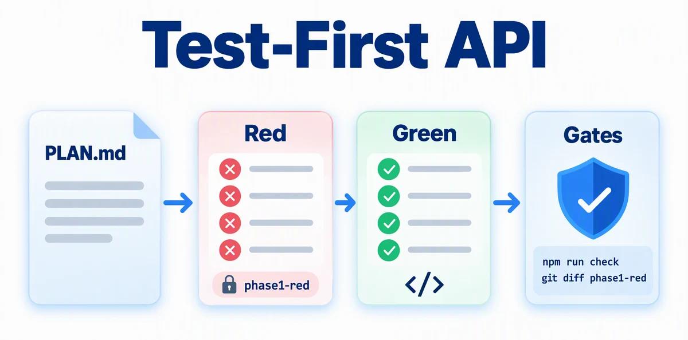
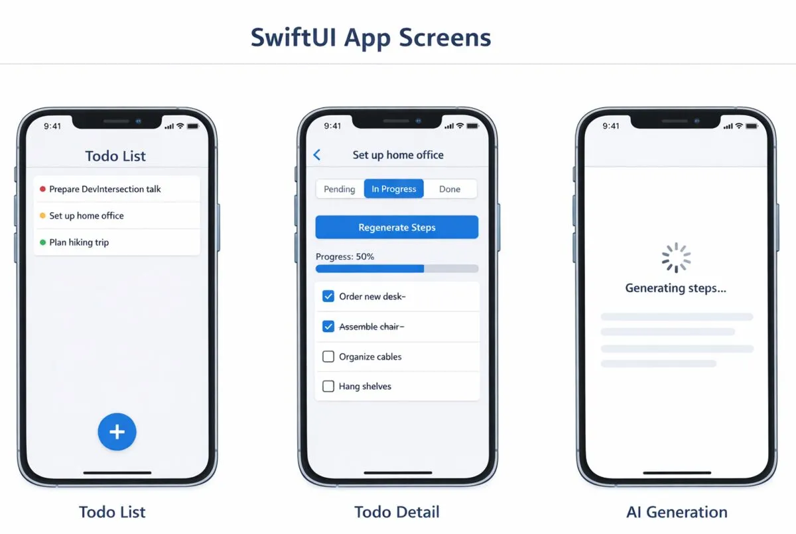
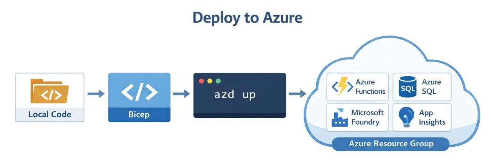

# SmartTodo - AI-Powered Task App

> ✨ **Build an iPhone app and its Azure backend the way teams ship with agents: issues first, a plan interview, failing tests before code, and gates that decide what ships.**

<p align="center">
  
</p>

You'll build SmartTodo, an iPhone app that turns a todo such as "Prepare conference talk" into concrete steps you can check off. The API runs on Azure Functions Flex Consumption, Azure SQL stores the data, and gpt-5-mini on Microsoft Foundry writes the steps.

Deploying to Azure is the easy part for an agent. Getting a result that's worth deploying is the hard part. So you won't paste giant prompts and watch. You'll make the decisions, review the tests, and let deterministic gates, not the agent's opinion, decide when work is done. At the end, you'll automate the whole loop into a factory that delivers the next feature from a GitHub issue.

## Learning Objectives

- Turn an architecture diagram into GitHub issues and interview the plan with the `grill-plan` skill before any code exists
- Drive an agent with red/green test-driven development using the `tdd-builder` custom agent, `/autopilot`, `/plan`, and `/fleet`, and prove the agent didn't change the tests
- Gate every phase with commands that have exit codes: unit and contract tests, a black-box API verifier, iOS UI tests, and an infrastructure check
- Ship through GitHub with worktrees, stacked pull requests, required checks, Copilot code review, and auto-merge
- Ask an agent what the architecture costs and how to improve it, then deploy Azure Functions, Azure SQL with managed identity, and Microsoft Foundry with `azd`
- Turn what worked into a reusable skill, a deterministic script that needs no AI, and a Copilot cloud agent setup for the next feature

> 💰 **Estimated Cost**: ~$10–30/month while the Azure resources exist, plus about 3,000–4,500 Copilot AI credits for the whole journey (see [Cost Breakdown](#cost-breakdown)). Phases 0 to 2 need no Azure resources. Complete the [Cleanup](#cleanup) procedure when you finish.

## Prerequisites

| Host tool | Requirement | Purpose | Validation |
| --- | --- | --- | --- |
| [GitHub CLI](https://cli.github.com/) | Required | Issues, pull requests, and repository settings | `gh auth status` |
| [Git](https://git-scm.com/downloads) 2.20 or later | Required | Branches and worktrees | `git --version` |
| [GitHub Copilot CLI](https://docs.github.com/en/copilot/how-tos/copilot-cli/cli-getting-started) | Required | Run the coding agent | `copilot --version` |
| [Node.js](https://nodejs.org/en/download) LTS or later | Required | API, scripts, hooks, and the verifier | `node --version` |
| [Azure Functions Core Tools](https://learn.microsoft.com/azure/azure-functions/functions-run-local#install-the-azure-functions-core-tools) v4 | Required | Run the API locally | `func --version` |
| [Azure CLI](https://learn.microsoft.com/cli/azure/install-azure-cli) | Required for Phase 3 | Bicep build and lint, and Azure sign-in | `az version` |
| [Azure Developer CLI (`azd`)](https://learn.microsoft.com/azure/developer/azure-developer-cli/install-azd) 1.28.0 or later | Required for Phase 3 | Preview, provision, and remove the deployment | `azd version` |
| Go-based [`sqlcmd`](https://learn.microsoft.com/sql/tools/sqlcmd/sqlcmd-download-install) | Required for Phase 3 | Managed-identity database access and schema | `sqlcmd --version` |
| [Xcode](https://developer.apple.com/xcode/) with an iOS simulator runtime | Required only for running Phase 2 on your machine | Build and test the SwiftUI app | `xcodebuild -version`, then `xcrun simctl list runtimes` shows an iOS runtime |

You also need a GitHub account and an Azure subscription. Copilot code review and the Copilot cloud agent (Phase 4) need a Copilot plan that includes them. If yours doesn't, the journey tells you what to do instead at each of those steps, and every gate still runs.

Run the validation commands before Phase 0, and confirm that `az account show --output table` shows the intended subscription before Phase 3. If Xcode lists no iOS runtime, run `xcodebuild -downloadPlatform iOS` (about 8 GB). The [cross-platform installation guide](../../docs/tool-installation.md) has Windows, Mac, and Linux options.

> [!IMPORTANT]
> **Platform gate:** Every phase works on Windows, Mac, and Linux except running the iOS app. On Windows or Linux, you can still generate the SwiftUI app in Phase 2. The `ios` CI check runs its tests on a GitHub-hosted macOS runner.

> [!NOTE]
> GitHub Copilot CLI is the documented and validated command-line path. For another agentic coding tool, run: **"Copy or adapt this repository's `.github/skills` and `.github/agents` into your supported locations, preserving their behavior and reporting anything unsupported."**

---

## Architecture

<p align="center">
  
</p>

Phase 3 creates these resources in one resource group: Azure Functions (Flex Consumption) for the API, Azure SQL Database for todos and steps, Microsoft Foundry with gpt-5-mini for task decomposition, a storage account for the Functions runtime, and Application Insights with Log Analytics for monitoring.

---

## The Spec

SmartTodo is driven by a small set of linked plans. The agent reads them, and so do you when a prompt points at a section.

| Phase | Plan | You'll use it for |
| --- | --- | --- |
| 0. Plan the work | [`PLAN.md`](./PLAN.md) | Issues, quality gates, CI, repository rules, and branches |
| 1. API test-first | [`PLAN-phase1-api.md`](./PLAN-phase1-api.md) | API contracts, Decision Points, and the test strategy |
| 2. iOS from mockups | [`PLAN-phase2-ios.md`](./PLAN-phase2-ios.md) and [`images/mockups/`](./images/mockups/) | Screens, the API client, and iOS tests |
| 3. Azure with gates | [`PLAN-phase3-azure.md`](./PLAN-phase3-azure.md) | Cost review, infrastructure contract, and the infrastructure gate |
| 4. The factory | [`PLAN-phase4-factory.md`](./PLAN-phase4-factory.md) | Definition of done, the cloud agent, and the release pipeline |

Skim [`PLAN.md`](./PLAN.md) before you start. You don't need to read the phase plans end to end. Each prompt names the section that matters.

---

## How This Journey Works

Every phase runs the same loop:

```text
issue ─► grill the plan ─► red: failing tests ─► green: code ─► gates ─► review ─► merge
```

| You | The agent |
| --- | --- |
| Answer the plan interview questions | Asks the questions and records the decisions on the issue |
| Read the test names and fix what's missing | Writes the failing tests and the code that makes them pass |
| Run the gate commands and believe only their exit codes | Runs the same gates before it says it's done |
| Triage review findings | Fixes them through another red/green loop |

Steps marked 🐙 use GitHub.com features and need your own repository.

**Which model?** Use a frontier model for the plan interview, the red phases, and infrastructure. Smaller models are often enough for green phases, because the tests tell them exactly when they're done. Check spending with `/usage`; the [Cost Breakdown](#cost-breakdown) shows what each phase costs.

**Without Copilot code review:** leave it out of the ruleset, and run `/review` before you open each pull request instead. Triage its findings with the same rules. Everything else is unchanged.

<details>
<summary><strong>When something fails</strong></summary>

AI code generation isn't deterministic, so expect an occasional failure. Stay in the same Copilot session, remove secrets from the output, and use this prompt:

```text
The following command failed during <journey phase> on <OS and shell>:

<exact command>

Relevant error output:

<redacted error output>

Inspect the relevant application and Azure logs, explain the root cause,
make the smallest safe fix, rerun the failed step, and run the phase gate.
Note the problem and fix for the pull request's "Problems and fixes"
section. Do not print secrets.
```

</details>

---

## Phase 0: Plan the Work

### Step 1: Create the workspace

Generate the application in a separate workspace so this repository stays clean and the application becomes its own GitHub repository. From this repository's root, start `copilot` and run:

```
> Create the SmartTodo workspace described in the "Workspace Setup" section
  of journeys/smart-todo/PLAN.md, then show me its path and first commit.
```

The workspace copies the journey, agents, skills, and scripts, adds a `.gitignore` that keeps secrets out, and starts a Git repository.

End that session, change to the new workspace, and start a new session there. You'll work from this directory for the rest of the journey:

```text
cd ../smart-todo-workspace/journeys/smart-todo
copilot
```

If you haven't installed the Azure Skills plugin yet, do it now:

```
> /plugin marketplace add microsoft/azure-skills
> /plugin install azure@azure-skills
```

### Step 2: Publish and protect the repository 🐙

```
> Generate .github/workflows/ci.yml as described in the "Continuous
  Integration" section of PLAN.md and commit it. Then create a GitHub
  repository named smart-todo from this workspace with the GitHub CLI and
  push main. Make it public unless I say otherwise. Before pushing, confirm
  that no secrets or generated files are tracked. Then apply the
  "Repository Protection" section of PLAN.md and tell me whether the
  ruleset is enforced.
```

**Gate:** `gh ruleset list` shows one active ruleset, and `gh run list --workflow ci.yml` shows a successful run on `main`.

From now on, nothing reaches `main` without a pull request, green checks, and resolved review comments, including the agent's work. The CI jobs skip their work until the API, iOS app, and infrastructure exist, so they pass from the first commit.

### Step 3: Turn the architecture into issues 🐙

Attach the diagram and let the agent break the work down:

```
> @images/architecture.png This is the SmartTodo architecture. Read PLAN.md,
  then create the issues described in its "Issue Breakdown" section. Show me
  each issue number and title.
```

Open the issues on GitHub. Note the numbers for Phase 1, 2, and 3. The prompts below call them `<api-issue>`, `<ios-issue>`, and `<azure-issue>`.

**💡 What you're learning:** Issues are shared memory. Decisions, pull requests, review comments, and known limitations attach to them, so the next session, teammate, or cloud agent starts with the same context you have.

---

## Phase 1: Build the API Test-First

<p align="center">
  
</p>

You'll build the Azure Functions API with Node.js and TypeScript. Locally, it uses an in-memory store and a fake AI generator, so this phase needs no database, no AI key, and no Azure resources.

### Step 1: Grill the plan

Create the branch, then start the interview in an interactive `copilot` session:

```text
git switch -c phase-1-api
```

```
> Use the grill-plan skill on issue #<api-issue>. Read PLAN.md and
  PLAN-phase1-api.md first. When we finish, post the Decisions and the
  Test list as a comment on the issue.
```

Answer each question. Saying "use the defaults" is fine on your first run.

**💡 What you're learning:** Each question is a decision the agent would otherwise make silently, such as what happens when the model returns nine steps. The plan's [Decision Points](./PLAN-phase1-api.md#decision-points) section steers the interview so the questions that matter always come up. Writing a section like that is how you steer an agent's questions in your own projects.

### Step 2: Red: write the failing tests

```
> Use the tdd-builder agent for the red phase of issue #<api-issue>.
  Scaffold src/api as described in the "Project Structure", "Local
  Providers", and "Quality Gate" sections of PLAN-phase1-api.md. Then write
  the tests from its "Test Strategy" section and the Decisions comment on
  the issue. Tag the red commit phase1-red.
```

Confirm the tests fail for the right reason:

```text
cd src/api
npm test
cd ../..
```

The failures must be assertions or `Not implemented` errors. Import or compile errors mean the red phase isn't done, so ask the agent to fix the setup.

**🔍 Review the tests, not code.** Read the Requirement → Test table the agent printed. Every interview decision needs a test, boundaries need both sides (500 characters passes, 501 fails), and fixtures must make sense: a pending todo whose only step is checked becomes `completed`, not `in_progress`. If something is wrong, fix it now, while it's cheap:

```
> The Decision Point 3 test gives the todo only one step, so completing it
  triggers auto-completion. Give the todo two steps and complete only the
  first. Keep it red. Amend the red commit and move the phase1-red tag.
```

**💡 What you're learning:** You're reviewing around forty test names instead of a thousand lines of generated code. A misunderstanding caught in a test name costs one sentence to fix.

### Step 3: Green: let the agent make them pass

Autopilot keeps working until the objective is met. Add `--max-ai-credits <n>` to cap spending.

```
> /autopilot Use the tdd-builder agent for the green phase of issue
  #<api-issue>. Implement src/api until "npm run check" passes. Do not
  change anything under src/api/test. Commit the result as a green commit.
```

<details>
<summary>Optional: split the work across parallel agents with <code>/plan</code> and <code>/fleet</code></summary>

`/fleet` runs several subagents at once, each owning part of a plan. It shows how agents divide work, but costs about ten times more than autopilot here. Run `/plan Plan the green phase of issue #<api-issue> as independent tracks: data stores, AI, and HTTP handlers.`, review the plan, and **leave plan mode** (Shift+Tab) so the subagents can write files. Then run `/fleet Implement the plan with the tdd-builder agent's green-phase rules and commit the result as a green commit.`

</details>

**Gate:** Both commands must exit `0`:

```text
cd src/api
npm run check
cd ../..
git diff --exit-code phase1-red -- src/api/test
```

**💡 What you're learning:** The second command is why you can trust the first. An agent that's trying to make tests pass can "fix" the tests. The diff proves it didn't.

### Step 4: Prove it from the outside

Unit tests prove the pieces. The checked-in verifier proves the running API from outside, and you didn't let the agent write it.

1. In one terminal, from `src/api`, start the storage emulator with `npm run azurite`.
2. In a second terminal, from `src/api`, run `npm run build`, then `func start`. If port 7071 is in use, use `func start --port <port>` and that port below.
3. In a third terminal, from `journeys/smart-todo`, run:

```text
node ../../.github/scripts/verify-smart-todo.mjs --base-url http://localhost:7071
```

**Gate:** It prints `PASS: seed, validation errors, create, AI steps, auto-completion, reopen, delete, and final absence`.

Leave the API running for Phase 2. Then get a review:

```
> /review Review the phase-1-api branch against PLAN-phase1-api.md and the
  Decisions comment on issue #<api-issue>. Report only correctness,
  security, and contract issues.
```

Decide what to do with each finding, then hand it back:

```
> Triage these /review findings with the "Review Triage" section of
  PLAN.md: fix <numbers>, file <number> as a known-limitation issue.
```

The agent writes each fix as a new red commit (moving the `phase1-red` tag), then a green commit. For a second opinion, run `/rubber-duck` with a different model.

### Step 5: Ship through the gate 🐙

```
> Push phase-1-api and open a pull request that closes #<api-issue>. Paste
  the gate results into the description. Don't enable auto-merge yet.
```

Watch the checks with `gh pr checks --watch`. Copilot code review posts one review a few minutes after the pull request opens (check with `gh pr view --json reviews`). **Don't enable auto-merge before it arrives**: a review comment only blocks the merge once it exists.

Start Phase 2 while CI and review run. When the review arrives, read it, then hand it to the agent:

```
> Handle the Copilot code review on this pull request with the triage
  procedure in the "Review Triage" section of PLAN.md.
```

Copilot reviews each pull request once, so there's no second round to wait for. Enable auto-merge with `gh pr merge --auto --squash`; the ruleset merges when every check is green and every thread is resolved.

**💡 What you're learning:** Each reviewer finds things the others miss. The tests catch contract bugs, `/review` catches gaps in the plan's rules, and Copilot code review catches things like a model parameter gpt-5-mini rejects in production. Layered review is worth it; unlimited rounds aren't, because each round finds something new in the last fix.

---

## Phase 2: Build the iOS App from Mockups

<p align="center">
  
</p>

This phase starts from [mockups](./images/mockups/smart-todo-mockups.png) instead of an architecture diagram, and from a starter Xcode project in [`starter/ios`](./starter/ios) so the agent doesn't have to hand-write Xcode's project file. The tests run against an in-app fake client, so they need no running API.

> **New to Swift?** `Codable` handles JSON like TypeScript interfaces, `async/await` works as in JavaScript, and `#if DEBUG` is a compile-time flag. XCTest runs unit tests, and XCUITest drives the app in a simulator the way a person would.

### Step 1: Stack a worktree on Phase 1

A worktree is a second checkout of the same repository, so Phase 2 can move forward while Phase 1 is in review. From `journeys/smart-todo`:

```text
git worktree add ../../../smart-todo-ios -b phase-2-ios phase-1-api
cd ../../../smart-todo-ios/journeys/smart-todo
copilot
```

If Phase 1 already merged, run `git fetch` first and use `origin/main` instead of `phase-1-api`. Inside Copilot CLI, `/worktree` creates a worktree without leaving the session.

### Step 2: Grill and red from the mockups

```
> @images/mockups/smart-todo-mockups.png These are the SmartTodo mockups.
  Use the grill-plan skill on issue #<ios-issue> with PLAN-phase2-ios.md,
  and post the decisions to the issue.
```

```
> Use the tdd-builder agent for the red phase of issue #<ios-issue>. Copy
  starter/ios to src/ios as the "Project Layout" section of
  PLAN-phase2-ios.md describes, then write the tests from its "Test
  Strategy" section and scripts/test-ios.mjs from its "Quality Gate"
  section. Tag the red commit phase2-red.
```

On a Mac, run `node scripts/test-ios.mjs`. The build must succeed and the tests must fail. Read the UI test and compare its steps with the mockups, and check that test fixtures match the Phase 1 [Seed Data](./PLAN-phase1-api.md#seed-data) and status rules.

### Step 3: Green

```
> /autopilot Use the tdd-builder agent for the green phase of issue
  #<ios-issue>. Build the views from the mockups and PLAN-phase2-ios.md
  until "node scripts/test-ios.mjs" passes. Do not change the test targets
  or scripts/test-ios.mjs. Commit the result as a green commit.
```

**Gate (Mac):** Both commands must exit `0`:

```text
node scripts/test-ios.mjs
git diff --exit-code phase2-red -- scripts/test-ios.mjs src/ios/SmartTodoTests src/ios/SmartTodoUITests
```

On Windows or Linux, skip to Step 5. The `ios` CI check runs the tests on a macOS runner.

**If the diff gate fails**, the agent changed a red-phase test. Read the diff and decide. If the test was wrong, commit only the test change as a new red commit, move the tag with `git tag -f phase2-red`, then commit the implementation as green. If the test was right, restore it with `git checkout phase2-red -- <file>` and ask the agent to fix the code instead.

### Step 4: Try it

Open `src/ios/SmartTodo.xcodeproj` in Xcode, select an iPhone simulator, and run it (⌘R) against the local API from Phase 1. In Xcode 27 and later, the simulator window is in the **Device Hub** app. Add "Plan a weekend camping trip", generate steps, check them all off, and confirm the list shows `completed`.

The UI test proves the flow someone scripted. Exploratory testing finds what nobody scripted. Change the simulator's appearance and text size from the command line, relaunch, and look:

```text
xcrun simctl ui booted appearance dark
xcrun simctl ui booted content_size accessibility-extra-extra-large
xcrun simctl io booted screenshot smart-todo-dark-xxl.png
```

Try a very long title and a todo with seven steps too. Restore the defaults with `appearance light` and `content_size large`. When you find a real bug, turn it into an XCUITest first, then fix it.

<details>
<summary>Optional: let Computer Use inspect the app</summary>

Computer Use lets an agent read the running app's accessibility tree and screenshots. It needs an interactive session and Accessibility and Screen Recording permissions for the **Copilot Computer Use** helper app. Run `/computer`, then ask: `Inspect SmartTodo in Device Hub and report layout problems, truncated text, and differences from the mockups, with screenshots. Do not change code.` In Xcode 27 it can read the simulated app but not tap or type into it, so put the app in each state yourself. Its results vary, so it isn't a gate.

</details>

### Step 5: Ship a stacked pull request 🐙

```
> Push phase-2-ios and open a pull request that closes #<ios-issue>. Use
  phase-1-api as the base if it hasn't merged yet, otherwise main. Don't
  enable auto-merge.
```

Handle the Copilot code review with the Phase 1 triage prompt.

A stacked pull request shows only the iOS changes. Don't enable auto-merge while its base is `phase-1-api`: that branch has no rules, so it would merge immediately into Phase 1.

When Phase 1 merges, GitHub deletes `phase-1-api` and retargets this pull request to `main`. Because Phase 1 was squashed into one new commit, replay only the iOS commits onto `main`, move the red tag to the replayed red commit (`git tag -f phase2-red <commit>`), and enable auto-merge once the review threads are resolved:

```text
git fetch origin
git rebase --onto origin/main phase-1-api
git push --force-with-lease
gh pr merge --auto --squash
```

---

## Phase 3: Deploy to Azure with Gates

<p align="center">
  
</p>

Start after Phase 1 merges. Stop the local API first (Ctrl+C): switching branches while `func start` runs from the same directory crashes the Functions host. If Phase 2 still needs a local API, start it from the `smart-todo-ios` worktree instead. Then, in your original workspace (`smart-todo-workspace/journeys/smart-todo`):

```text
git switch main
git pull
git switch -c phase-3-azure
azd config set auth.useAzCliAuth true
```

### Step 1: Ask what it costs and how to make it better

```
> Do the "Cost and Architecture Review" in PLAN-phase3-azure.md for issue
  #<azure-issue>. This is read-only. Do not change files.
```

Pick zero or one improvement for this run. The defaults work. If you adopt one, have the agent add it to `PLAN-phase3-azure.md` first, because the plan is what the generator, the gate, and the review all bind to. Then post your decisions:

```
> Post the cost estimate and my decisions as a comment on issue #<azure-issue>.
```

**💡 What you're learning:** Agents are very good at cloud trade-offs. You still own the decision, and the plan records it.

### Step 2: Red: write the infrastructure gate first

```
> Create scripts/check-infra.mjs exactly as the "Infrastructure Gate"
  section of PLAN-phase3-azure.md specifies. Run it with --offline and show
  me that it fails because the infrastructure doesn't exist yet. Commit it
  and tag the commit phase3-red.
```

**💡 What you're learning:** You just turned the plan's list of deployment gotchas into a program. Every rule an earlier deployment learned the hard way is now checked in seconds, for free, before anything reaches Azure.

### Step 3: Green: generate infrastructure until the gate passes

```
> /autopilot Generate the infrastructure in the "Azure Deployment" section
  of PLAN-phase3-azure.md until "node scripts/check-infra.mjs --offline"
  passes. Do not change scripts/check-infra.mjs.
```

**Gate:** Both commands must exit `0`:

```text
node scripts/check-infra.mjs --offline
git diff --exit-code phase3-red -- scripts/check-infra.mjs
```

Read the infrastructure diff too. A gate only works if it checks what actually deploys, so watch for changes that satisfy a rule without changing the resource it describes.

### Step 4: Preview, deploy, and verify

Prepare the `azd` environment: provider registration, your subscription and principal, and the region.

```
> Prepare this azd environment as the "Environment Preparation" section of
  PLAN-phase3-azure.md describes. Don't run azd up.
```

If you'd rather set the values yourself, the commands are in the Environment Preparation section of [`PLAN-phase3-azure.md`](./PLAN-phase3-azure.md#environment-preparation).

Run the full gate, which adds an Azure what-if preview without creating resources:

```text
node scripts/check-infra.mjs
```

When it passes, deploy. Run this yourself, because it prompts for an environment name and location and streams output worth watching:

```text
azd up
```

The first `azd up` must end with `Post-provision SQL setup complete.` from the hook, which creates the Function App's database user. The API creates its own tables and seed data on its first request. If the hook fails, use the "When something fails" prompt, then run `node infra/hooks/postprovision.js` directly until it prints that line. It's safe to run more than once. Afterward, only `AllowAzureServices` may remain: run `az sql server firewall-rule list --resource-group <resource-group> --server <sql-server> --query "[].name" --output tsv` with the values from `azd env get-value RESOURCE_GROUP_NAME` and `azd env get-value SQL_SERVER_NAME` (the part before the first dot).

**Gate:** The same verifier from Phase 1, now pointed at Azure:

```text
node ../../.github/scripts/verify-smart-todo.mjs
```

It reads `API_URL` through `azd` and must print the same `PASS` line as before. This time the steps come from gpt-5-mini.

### Step 5: Point the iOS app at Azure (Mac)

Get the URL with `azd env get-value API_URL`, set `Config.apiBaseURL` to it, and run the app in the simulator. Generate steps for a real goal and compare them with the fake ones.

### Step 6: Make it repeatable

```
> Create the skill in the "Reusable Infrastructure Skill" section and the
  script in the "Deterministic Scaffold" section of PLAN-phase3-azure.md.
  Then run the scaffold proof from that section.
```

**Gate:** The scaffold proof passes: a fresh copy passes `check-infra.mjs --offline` with no AI involved.

**💡 What you're learning:** Knowledge moves up a ladder as it proves itself:

| Form | Cost per use | Same result every time? |
| --- | --- | --- |
| A prompt | AI credits and your attention | No |
| A skill (`SKILL.md`) | AI credits | More often, because the agent starts with the lessons |
| A script (`scaffold-infra.mjs` + `check-infra.mjs`) | Free, in seconds | Yes |

Use a prompt to discover how to do something, a skill to repeat it well, and a script once the result stops changing.

### Step 7: Ship 🐙

```
> Commit the infrastructure, skill, and scripts. Push phase-3-azure and
  open a pull request that closes #<azure-issue>, with the verifier's PASS
  line in the description. Don't enable auto-merge.
```

The `infra` check runs `check-infra.mjs --offline`. Handle the Copilot code review with the same prompt as Phase 1; because this pull request changes `infra/`, the triage procedure also redeploys and reruns the verifier before it replies.

Then enable auto-merge with `gh pr merge --auto --squash`. From now on, every pull request that changes `src/api` or `infra` also passes [Verify Before Merge](./PLAN.md#verify-before-merge): deploy the branch, run the verifier, and paste the `PASS` line.

---

## Phase 4: Build the Factory

You ran the same loop three times by hand: issue, interview, red, green, gates, review, merge. Now you'll write that loop down so the next feature runs through it without you driving every step.

### Step 1: Write down the definition of done

```
> Create .github/copilot-instructions.md and
  .github/workflows/copilot-setup-steps.yml as described in the "Definition
  of Done" and "Cloud Agent Environment" sections of PLAN-phase4-factory.md.
  Open a pull request. Don't enable auto-merge.
```

Triage the Copilot code review as before, then enable auto-merge. After it merges:

1. Run `gh workflow run copilot-setup-steps.yml` and confirm it succeeds with `gh run list --workflow copilot-setup-steps.yml`.
2. In the repository's **Settings**, open **Copilot** → **Cloud agent** and turn off **Require approval for workflow runs**, so CI runs on the agent's pushes without you approving each one. It's safe here because `ci.yml` uses no secrets.

### Step 2: Hand an issue to the cloud agent 🐙

```
> Create the issue in the "Feature Issue: Due Dates" section of
  PLAN-phase4-factory.md and show me its URL.
```

**Gate:** Phases 1, 2, and 3 are merged (`git log --oneline origin/main` shows all three). The cloud agent branches from `main` when you assign it, so assigning earlier makes it rebuild whatever hasn't merged yet.

On GitHub, open the issue, select **Assignees**, choose **Copilot**, select the **tdd-builder** agent, and assign it. The agent works in its own sandboxed GitHub Actions environment, built by your setup steps. It opens a **draft** pull request right away and runs the full cycle there: plan update, red commit, then green commits. It usually finishes in 15–25 minutes, when the pull request timeline shows that Copilot finished working.

To assign from the command line instead, see [Assign the Cloud Agent](./PLAN-phase4-factory.md#assign-the-cloud-agent).

**Without the cloud agent:** create a worktree for the issue and run the tdd-builder agent's full cycle locally: `Use the tdd-builder agent for the full cycle of issue #<number>.` Then ship it through the same pull request steps.

### Step 3: Be the reviewer

1. Read the red commit's test names, which the agent lists in the description. Did it understand the issue?
2. When a check fails, paste the error line from the check log into a `@copilot` comment. The agent can't build Swift in its Linux environment, so the `ios` check is how it learns the app doesn't compile.
3. Select **Ready for review** (`gh pr ready <number>`); a draft can't merge, and Copilot code review starts only after the pull request leaves draft. Remove the `[WIP]` prefix from the title, because the squash commit on `main` uses it.
4. Triage the Copilot code review. Put every fix in one `@copilot` comment so the agent pushes once.
5. Run [Verify Before Merge](./PLAN.md#verify-before-merge): `gh pr checkout <number>`, `azd deploy api`, and the deployed verifier. On a Mac, also run the app from the branch.
6. When every thread is resolved, approve the pull request and enable auto-merge.

### Step 4 (optional): Ship on merge

```
> Set up the "Release Pipeline (Optional)" in PLAN-phase4-factory.md. Stop
  and ask me before creating any Azure identity or granting any role.
```

Merge any small change and watch the release run end with the verifier's `PASS` line. Schema changes such as due dates ship with the code, because the API applies its migrations at startup.

### What you built

| What you did by hand | What does it now |
| --- | --- |
| Broke the architecture into work | Issues and sub-issues |
| Decided the ambiguous parts | The `grill-plan` skill and each plan's Decision Points |
| Wrote tests first and kept them fixed | The `tdd-builder` custom agent |
| Checked that it works | `ci.yml` gates and the checked-in verifier |
| Checked that it's safe to merge | The ruleset, Copilot code review, and auto-merge |
| Set up the agent's machine | `copilot-setup-steps.yml` |
| Remembered how to deploy | The infrastructure skill, `scaffold-infra.mjs`, and `check-infra.mjs` |
| Deployed | `release.yml` (optional) |

The next step is running the factory on a schedule without anyone starting it. This repository does that for its own journeys: [`.github/workflows/journey-e2e-test.md`](../../.github/workflows/journey-e2e-test.md) is an agentic workflow that runs a journey end to end and files a report as an issue.

---

<details>
<summary>How Agentic AI is Used</summary>

## How Agentic AI is Used

| Layer | What it demonstrates |
|-------|----------------------|
| **Planning and interviews** | Copilot turns a diagram into issues, and `grill-plan` makes you decide the ambiguous parts first |
| **Test-driven generation** | `tdd-builder` writes failing tests, then code, and a diff proves the tests held |
| **Review** | `/review` and Copilot code review catch what tests and plans missed |
| **Cloud and infrastructure** | Copilot estimates cost and generates Bicep until a deterministic gate passes |
| **Delegation** | The Copilot cloud agent delivers a feature through the same gates |
| **Inside the app** | gpt-5-mini breaks goals into steps, with an explicit output format and defensive parsing |

</details>

<details>
<summary>Lessons from validation runs</summary>

## Lessons from Validation Runs

This journey was run end to end three times before publishing. Each rule below exists because a run broke without it.

- **Auto-merge before review merged unreviewed code.** A pull request merged four minutes before Copilot's review posted four real findings. Hence: wait for the review, and require conversation resolution.
- **Review rounds multiplied.** Every push started a new review, and each round found something in the last fix. Three rounds on one pull request cost more than the implementation. Hence: one round, one push.
- **Agents edit tests when stuck.** Autopilot started a second pass that changed two tests after the first pass refused to. Both edits happened to be right, but only the diff gate showed they happened.
- **Agents game gates.** One couldn't satisfy an infrastructure rule, so it added a metadata field containing the expected text. The gate now checks only deployable resources.
- **Local fakes hide production bugs.** gpt-5-mini rejected `max_tokens`, a SQL date was bound as a string, and a schema change shipped before its column existed. None of them showed up with the fake AI and the in-memory store. Hence: boundary tests and Verify Before Merge.
- **Cleanup must survive failure.** The deployment hook left a temporary SQL firewall rule open twice, once from an unsupported flag and once from a crash right after creating it.
- **Timing matters for the cloud agent.** An issue assigned before Phase 2 merged made the agent rebuild the iOS app, and every Swift file conflicted.
- **Plan mode blocks writes.** `/fleet` launched while the session was still in plan mode; three subagents designed everything and wrote nothing.

</details>

---

## Assignment

1. **Improve the AI through the factory.** Write an issue asking for time estimates in each generated step, and assign it to the cloud agent. How did the agent test a prompt change without calling the real model?
2. **Try a different model.** Switch the Foundry deployment to gpt-4.1, generate steps for the same todo with each model, and compare quality and latency.
3. **Observe the app.** Ask Copilot to query Application Insights for request counts, failures, and the slowest endpoint over the last hour, and to show the KQL it used.
4. **Harden security.** Pick one: move `AZURE_AI_KEY` to Key Vault, switch AI to managed identity, add rate limiting to `generate-steps`, or require a function key. Each change starts with a plan update and a failing test. See [Production Hardening](./PLAN.md#production-hardening-out-of-scope).

---

## Cost Breakdown

**Azure (while the resources exist):**

| Resource | SKU | Monthly Cost |
|----------|-----|--------------|
| Azure Functions | Flex Consumption (scale to zero) | ~$0-5 |
| Azure SQL Database | Basic (5 DTU) | ~$5 |
| Microsoft Foundry (AIServices) | Pay-per-token (gpt-5-mini) | ~$1-10 |
| Application Insights | Pay-per-GB | ~$0-5 |
| Log Analytics | Pay-per-GB | ~$0-5 |
| Storage Account | Standard LRS | ~$1 |
| **Total** | | **~$10-30/month** |

**Copilot (the whole journey, with a frontier model):** about 3,000–4,500 AI credits in local sessions, measured in validation runs: roughly 130 for Phase 0, 900 each for Phases 1 (2,100 with the optional `/fleet`), 2, and 3, and 300 for Phase 4 plus its cloud agent sessions. Review triage is the largest cost in each phase. Add `--max-ai-credits <n>` to `/autopilot` to cap a single run.

**GitHub Actions:** free for public repositories on standard runners. For private repositories, macOS minutes (the `ios` check) count at a higher rate than Linux and Windows minutes. The Copilot cloud agent uses Actions minutes too.

---

<details>
<summary>Troubleshooting</summary>

## Troubleshooting

| Symptom | Cause and fix |
| --- | --- |
| A required check says "Expected — Waiting for status to be reported" | A job named `api`, `ios`, or `infra` never ran, usually because of a `paths` filter or a renamed job. Every job must always run and succeed when its area doesn't exist yet ([Continuous Integration](./PLAN.md#continuous-integration)). |
| The pull request merged before Copilot code review posted | Auto-merge was on when the pull request opened. Handle the late comments in a follow-up pull request, and enable auto-merge only after the review from now on. |
| A pull request shows "no checks reported" | It conflicts with `main`, and GitHub doesn't run workflows on a conflicting pull request. Merge `origin/main`, resolve, and push (or ask `@copilot` to). |
| Checks never start on the cloud agent's pull request | Turn off **Require approval for workflow runs** (Settings → Copilot → Cloud agent), or run `gh run rerun <run-id>` for the run whose conclusion is `action_required`. |
| The ruleset exists but doesn't block merging | Rulesets on private repositories need GitHub Pro, Team, or Enterprise. Make the repository public, or continue knowing the gates don't block. |
| The red phase fails with import or compile errors | Ask the agent for stubs that throw `Not implemented`, so tests compile and fail on assertions. |
| `git diff --exit-code phase1-red` fails after a review fix | Commit review-driven tests as their own red commit and move the tag with `git tag -f phase1-red` before the fix. |
| `xcodebuild` can't find tests, or a new Swift file isn't compiled | Start from `starter/ios`, whose synchronized folders include every file in each target folder and whose shared scheme includes both test targets. |
| Functions finds no functions locally | `"main"` in `package.json` must be `"dist/functions/*.js"`, and run `npm run build` before `func start`. |
| The Function App returns 500 on database calls | The managed identity lacks database access, or `AZURE_SQL_SERVER` isn't the full `<sql-name>.database.windows.net` name. Rerun `node infra/hooks/postprovision.js` as the Microsoft Entra administrator. |
| AI step generation returns 503 in Azure | Check that `AI_PROVIDER=foundry` and the `AZURE_AI_*` settings exist (without printing values), and that the request uses `max_completion_tokens`, not `max_tokens`. |
| A soft-deleted Cognitive Services account blocks redeployment | `az cognitiveservices account list-deleted`, then `az cognitiveservices account purge --name <name> --resource-group <rg> --location <location>`. |
| `azd deploy` fails during the Oryx TypeScript build | Don't exclude `src/` or `tsconfig.json` in `.funcignore`. |
| The iOS app can't reach the API | Locally, the API must run on `localhost:7071`. For Azure, `Config.apiBaseURL` must match `azd env get-value API_URL`, use `https://`, and have no trailing slash. |
| The simulator says the application failed preflight checks | Uninstall SmartTodo from the simulator, restart it, run **Product > Clean Build Folder**, and launch again. |
| The first request after idle takes 5–10 seconds | Expected: Flex Consumption scales to zero, and the first request after a deployment also applies database migrations. |

</details>

---

## Verification Checklist

Every gate is a command that exits `0` on success. The full list, with the directory each one runs from, is in [Quality Gates](./PLAN.md#quality-gates): API tests, the red-tag diffs, the local and deployed verifier, the iOS tests, the infrastructure check, and Verify Before Merge.

---

## Cleanup

> [!CAUTION]
> This procedure permanently deletes the Function App, SQL database, Microsoft Foundry resource, and all journey data.

Read and save the resource group name, then remove the resources from `journeys/smart-todo`:

```text
azd env get-value RESOURCE_GROUP_NAME
azd down --force --purge
```

Confirm that `az group exists --name <resource-group-name>` returns `false`. If cleanup reports a soft-deleted Cognitive Services resource, purge it as described in [Troubleshooting](#troubleshooting).

Remove the Phase 2 worktree with `git worktree remove ../../../smart-todo-ios`. If you set up the release pipeline, also delete its recorded role assignments, then the identity resource group whose name you recorded during setup, then the repository variables, as the [Release Pipeline](./PLAN-phase4-factory.md#release-pipeline-optional) cleanup describes. Keep or delete the GitHub repository as you prefer.

---

## What's Next

- [AIMarket](../aimarket/README.md): a full-stack marketplace with AI Search and Foundry chat
- [Superset](../superset/README.md): an AKS deep dive
- Deploy an open-source app with `@oss-to-azure-deployer`
- Point your factory at your own idea: write a `PLAN.md` with Decision Points and Quality Gates, and start at Phase 0

> 📚 **All journeys:** [Back to root README](../../README.md#agentic-journeys)

---

## Resources

- [SmartTodo Plan](./PLAN.md) and the phase plans: [API](./PLAN-phase1-api.md), [iOS](./PLAN-phase2-ios.md), [Azure](./PLAN-phase3-azure.md), [Factory](./PLAN-phase4-factory.md)
- [Copilot CLI](https://docs.github.com/en/copilot/how-tos/use-copilot-agents/use-copilot-cli), [autopilot](https://docs.github.com/en/copilot/concepts/agents/copilot-cli/autopilot), and [/fleet](https://docs.github.com/en/copilot/concepts/agents/copilot-cli/fleet)
- [Creating custom agents](https://docs.github.com/en/copilot/how-tos/copilot-on-github/customize-copilot/customize-cloud-agent/create-custom-agents)
- [Configuring settings for the Copilot cloud agent](https://docs.github.com/en/copilot/how-tos/use-copilot-agents/cloud-agent/configuring-agent-settings)
- [About rulesets](https://docs.github.com/repositories/configuring-branches-and-merges-in-your-repository/managing-rulesets/about-rulesets)
- [Flex Consumption](https://learn.microsoft.com/azure/azure-functions/flex-consumption-plan), [Azure SQL managed identity](https://learn.microsoft.com/azure/azure-sql/database/authentication-aad-configure), [Azure Verified Modules](https://azure.github.io/Azure-Verified-Modules/indexes/bicep/), and [Azure Developer CLI](https://learn.microsoft.com/azure/developer/azure-developer-cli/)
- [SwiftUI tutorials](https://developer.apple.com/tutorials/swiftui)
